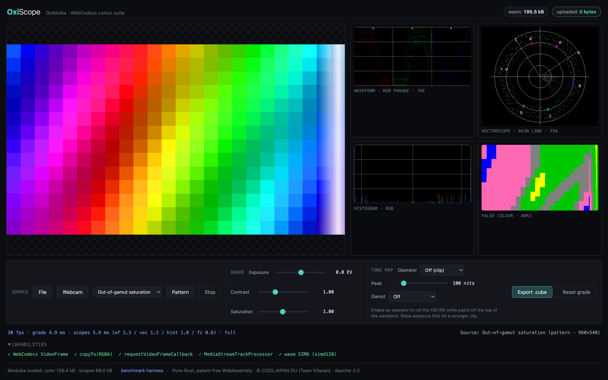

# OxiMedia

**Pure Rust reconstruction of OpenCV + FFmpeg** — A patent-free, memory-safe multimedia and computer vision framework.

[](LICENSE)
[](https://www.rust-lang.org)
[](https://github.com/cool-japan/oximedia)
[-brightgreen.svg)](https://github.com/cool-japan/oximedia)
[](https://github.com/cool-japan/oximedia)
[](https://github.com/cool-japan/oximedia)

[](https://cooljapan.tech/oxiscope/)

**OxiScope** — waveform, vectorscope, histogram and false colour, analysed at 30 fps by Pure-Rust WebAssembly, entirely in your browser. **[Try it live](https://cooljapan.tech/oxiscope/)** (your video never leaves your machine — the demo counts the bytes uploaded: 0) or run it locally with `./web/scripts/serve.sh`; see [OxiMedia Web](#oximedia-web-browser-modules) below.

**Live demos:** **[OxiScope](https://cooljapan.tech/oxiscope/)** (browser scopes + colour pipeline) · **[OxiLink](https://oxilink.cooljapan.tech/)** (peer-to-peer video call with a waveform ghost-trace showing exactly what the codec changed — zero media bytes through any server) — the same WebAssembly modules, running in production twice.

## Vision

OxiMedia is a **clean room, Pure Rust reconstruction** of both **FFmpeg** (multimedia processing) and **OpenCV** (computer vision) — unified in a single cohesive framework.

### FFmpeg Domain

Codec encoding and decoding for patent-free formats (AV1, VP9, VP8, Theora, Opus, Vorbis, FLAC, MP3 — decoder maturity varies per codec, from Verified down to bitstream-parsing-only. VP8 and VP9 now decode **key frames and inter frames** bit-exactly against libvpx, and FLAC is bit-exact against libFLAC/ffmpeg in both directions; AV1 decode is keyframe/intra only, and the in-tree Opus codec is untrustworthy in both directions — the wired surfaces refuse rather than pass its output on: see the [Codec Matrix](#codec-matrix) and [docs/codec_status.md](docs/codec_status.md)), container muxing/demuxing (MP4, MKV, MPEG-TS, OGG, AVI, FLV), streaming protocols (HLS, DASH, RTMP, SRT, WebRTC, SMPTE 2110), transcoding pipelines, filter graphs (DAG-based), audio metering (EBU R128), loudness normalization, packaging (CMAF, DRM/CENC), and server-side media delivery.

### OpenCV Domain

Computer vision (object detection, motion tracking, video enhancement, quality assessment), professional image I/O (DPX, OpenEXR, TIFF), video stabilization, scene analysis, shot detection, denoising (spatial/temporal/hybrid), camera calibration, color management (ICC, ACES, HDR), video scopes (waveform, vectorscope, histogram), and forensic analysis (ELA, PRNU, copy-move detection).

### Design Principles

- **Patent Freedom**: Only royalty-free codecs (AV1, VP9, Opus, FLAC, and more)
- **Memory Safety**: Zero unsafe code, compile-time guarantees
- **Async-First**: Built on Tokio for massive concurrency
- **Single Binary**: No DLL dependencies, no system library requirements
- **WASM Ready**: Runs in browser without transcoding servers
- **Sovereign**: 100% Pure Rust in the default build — as of 0.1.9, `cargo check --workspace` compiles **zero** C/C++/Fortran (no `aws-lc-sys`, `libsqlite3-sys`, `mlua-sys`, `shaderc-sys`, `zstd-sys`, or `openssl-sys` in the default dependency graph)

> A handful of C-backed integrations remain available behind **opt-in, non-default**
> Cargo features — `aws-sdk` (oximedia-cloud), `vulkan-backend` (oximedia-accel),
> `lua-scripting` (oximedia-automation), `quic-quinn` (oximedia-videoip). Enabling
> them accepts the C compilation cost; see
> [Optional C-backed features](#optional-c-backed-features-opt-in-non-default).

## FFmpeg + OpenCV, Reimagined

**FFmpeg** is the de facto standard for multimedia processing, but it is written in C with patent-encumbered codecs (H.264, H.265, AAC), chronic memory safety vulnerabilities, and notoriously complex build systems requiring dozens of system libraries.

**OpenCV** is the de facto standard for computer vision, but it depends on C++ with complex CMake builds, optional proprietary modules (CUDA, Intel IPP), and heavy system-level dependencies.

**OxiMedia unifies both** into a single Pure Rust framework with zero C/Fortran dependencies in the default build:

| | FFmpeg | OpenCV | OxiMedia |
|---|---|---|---|
| Language | C | C++ | Pure Rust |
| Memory safety | Manual | Manual | Compile-time guaranteed |
| Patent-free codecs | Opt-in | N/A | Default (AV1, VP9, Opus, FLAC) |
| Install | `./configure && make` + system deps | `cmake` + system deps | `cargo add oximedia` |
| WASM support | Limited (Emscripten) | Limited (Emscripten) | Native (`wasm32-unknown-unknown`) |
| CV + Media unified | No | No | Yes — single framework |

**From the FFmpeg world**: codec encode/decode, container mux/demux, streaming (HLS/DASH/RTMP/SRT/WebRTC), transcoding pipelines, filter graphs, audio processing, packaging, and media server.

**From the OpenCV world**: detection, tracking, stabilization, scene analysis, shot detection, denoising, calibration, image I/O (DPX/EXR/TIFF), color science, quality metrics (PSNR/SSIM/VMAF), and forensics.

**One `cargo add`** — no battling system library installations, no `pkg-config`, no `LD_LIBRARY_PATH`, no `brew install ffmpeg opencv`.

## Project Scale

OxiMedia is a **production-grade** framework at **v0.2.2** (active cycle):

| Metric | Value |
|--------|-------|
| Total workspace crates | 115 (111 library crates under `crates/` + `oximedia` facade + CLI + WASM + internal benchmark harness; confirmed via `cargo metadata --no-deps`, verified 2026-08-12) |
| Published to crates.io | 112 (3 of 115 crates carry `publish = false` — Python bindings ship to PyPI instead, WASM to npm instead, benchmark harness is internal-only; confirmed via `cargo metadata`) |
| Total SLOC (Rust) | ~3,048,000 (3,048,416 lines of code per `tokei . --exclude target --exclude web`, verified 2026-08-12) |
| Tests passing | 104,693 with `--all-features` (0 failures, 155 skipped) / 103,322 with default features (0 failures, 144 skipped) — `cargo nextest run --workspace`, 0 compiler warnings in both runs, verified 2026-08-12 |
| Stable crates | 111 |
| Alpha crates | 0 |
| Partial crates | 0 |
| License | Apache 2.0 |
| MSRV | Rust 1.87+ |

## Sovereign ML Pipelines (v0.1.7+)

OxiMedia 0.1.7 introduced the [`oximedia-ml`](crates/oximedia-ml/) crate — a typed
ML pipeline layer built atop the Pure-Rust [OxiONNX](https://crates.io/crates/oxionnx)
runtime. Inference is entirely opt-in; the default `oximedia` build still
pulls in **zero** ONNX symbols and stays C/Fortran-free.

### Available pipelines

| Pipeline                          | Feature             | I/O                                             | Reference model    |
|-----------------------------------|---------------------|-------------------------------------------------|--------------------|
| `SceneClassifier`                 | `scene-classifier`  | 224×224 RGB → `Vec<SceneClassification>`        | Places365 / ResNet |
| `ShotBoundaryDetector`            | `shot-boundary`     | 48×27 RGB window → `Vec<ShotBoundary>`          | TransNet V2        |
| `AestheticScorer`                 | `aesthetic-score`   | 224×224 RGB → `AestheticScore`                  | NIMA               |
| `ObjectDetector`                  | `object-detector`   | 640×640 RGB → `Vec<Detection>` (NMS)            | YOLOv8 (80 COCO)   |
| `FaceEmbedder`                    | `face-embedder`     | 112×112 RGB face → 512-dim `FaceEmbedding`      | ArcFace            |

### Quick start

```toml
[dependencies]
oximedia = { version = "0.2.2", features = ["ml", "ml-scene-classifier", "ml-onnx"] }
```

```rust,ignore
use oximedia::ml::pipelines::{SceneClassifier, SceneImage};
use oximedia::ml::{DeviceType, TypedPipeline};

let classifier = SceneClassifier::load("places365.onnx", DeviceType::auto())?;
let image = SceneImage::new(rgb_bytes, 224, 224)?;
for pred in classifier.run(image)? {
    println!("class {} -> {:.3}", pred.class_index, pred.score);
}
```

### Device selection

`DeviceType::auto()` probes the strongest available backend once and
memoises the result: **CUDA → DirectML → WebGPU → CPU**. Each backend is a
feature flag (`cuda`, `directml`, `webgpu`); CPU is always available.
`cuda` is native-only; every other backend — including the default CPU path
— compiles on `wasm32-unknown-unknown`.

### CLI

The `oximedia ml` namespace ships three subcommands (honour `--json` for
machine-readable output):

```bash
oximedia ml list                  # enumerate built-in pipelines + model zoo
oximedia ml probe                 # report GPU backend availability
oximedia ml run --pipeline scene-classifier \
                --model places365.onnx \
                --input frame.png \
                --device auto \
                --top-k 5 \
                --dry-run
```

### Downstream integrations

Several domain crates gain an `onnx` feature for an ML-backed fast path
while keeping the Pure-Rust default intact: `oximedia-scene`
(`MlSceneEnricher`), `oximedia-shots` (`MlShotDetector`),
`oximedia-caption-gen` (`CaptionEncoder`), `oximedia-recommend`
(`EmbeddingExtractor`), `oximedia-mir` (`MusicTagger`).

See [`docs/ml_guide.md`](docs/ml_guide.md) for the full feature matrix,
per-pipeline I/O contracts, device selection details, WASM support
matrix, and roadmap.

## What's New in v0.2.1

Released 2026-08-12. Theme: **The audio loudness stack is now standards-accurate and honest, OxiMedia gains Pure-Rust live camera/device capture, VP8 and VP9 decode inter frames bit-exactly, FLAC is conformant in both directions, and a workspace-wide sweep replaced fabricated success with real work or an honest error**.

- **EBU R128 loudness measurement and normalization are now standards-accurate** (`oximedia-metering`, `oximedia-audio`): the default K-weighting filter chain was wrong by up to ±35 dB against ITU-R BS.1770-4 Table 1 (a mis-implemented highpass stage, and a 3.9998 **dB** shelf gain used as a linear multiplier), stereo/multichannel programmes measured a flat 3.01 LU too quiet from a channel-averaging bug instead of the spec's channel sum, the crate-root `EbuR128Meter` alias resolved to the approximate meter instead of the accurate one, and `LoudnessNormalizer::normalize()` computed a correct gain and then silently discarded it, returning the input audio byte-identical. All four are fixed and pinned with new ITU-R BS.1770-4 conformance tests.
- **VP8 and VP9 now decode inter frames bit-exactly against libvpx** (`oximedia-codec`): VP9 gained cross-frame reference/probability state, inter mode and motion-vector entropy decode, eight-tap motion compensation and compound prediction — 10 of 10 conformance streams bit-exact through the public decoder API (inter-frame segmentation and reference scaling remain deferred behind a pinned, honest `Err`). VP8 gained motion-vector entropy decode, sub-pixel motion compensation and last/golden/altref reference management — bit-exact on 5 multi-frame streams, including one with a hidden altref frame. Both move to **Verified** decode in the Codec Matrix.
- **FLAC is now conformant in both directions** (`oximedia-codec`): the encoder and decoder had been a self-consistent toy pair that panicked on a real `ffmpeg`-produced file; both were rebuilt against RFC 9639 (subframe header bit-layout, the Rice unary convention, LPC precision/shift fields, stereo decorrelation, escaped partitions) and now round-trip against `libFLAC` and `ffmpeg` in both directions, promoting FLAC to **Verified**.
- **AVIF decodes to real pixels** (`oximedia-codec`): 8-bit 4:2:0 colour items decode through the AV1 keyframe decoder and are byte-identical to ffmpeg/dav1d on a real libaom fixture; alpha (real-world AVIF encodes it as monochrome AV1) and 10/12-bit items return an honest `Err` instead of fabricated output.
- **New `oximedia-capture` crate**: Pure-Rust live camera/device capture, the `libavdevice` equivalent, with AVFoundation (macOS), Video4Linux2 (Linux) and Media Foundation (Windows) backends and no C/C++/Fortran compiled on any of them. Verification is honestly per-platform rather than uniform — macOS is hardware-verified against real devices; Linux and Windows are compile- and host-tested, with live-device runs still open. Delivers raw pixel formats or untouched MJPEG only, so it cannot produce a Red List codec even in principle.
- **Workspace-wide fabricated-success elimination sweep**: nine areas that reported success without doing the work now either do the real work or refuse honestly — `oximedia-videoip`'s hardcoded fake decoders/encoders, `oximedia-mam`'s S3/Azure/GCS backends that logged and returned `Ok` unconditionally, `oximedia-server`'s CDN uploads and unsigned "presigned" URLs, `oximedia-workflow` tasks that returned `Ok(())` without executing, `oximedia-farm` sleeping instead of transcoding, and more. The count of `TODO(0.2.x)` markers in Rust source fell from **123 to 22**, with every survivor enumerated by `file:line` in `TODO.md`'s "Deferred (0.2.x)" section.
- **The in-tree Opus codec is demoted to Bitstream-parsing.** Fed real libopus packets for the first time this cycle, decode returned silence or out-of-range output and the encoder emitted a TOC byte that misdescribed its own payload. This is a label correction, not a new regression — every wired consumer (`oximedia-videoip`, the loudness normalizer, the frame-level transcode path) already refused to pass Opus through, and continues to. Treat Opus as untrustworthy in both directions until a conformant implementation lands.

## What's New in v0.2.0

Released 2026-07-15. Theme: **A real frame-level transcode engine, bit-exact AV1/VP9/VP8 key-frame video decoding, and a broad "real or honest error" sweep across the packager, network, workflow, Python bindings, and CLI layers**.

- **Real frame-level transcode engine** (`oximedia-transcode`): a genuine decode → filter → encode pipeline behind `TranscodePipeline`'s `requires_frame_level()` gate, replacing the previous stream-copy-only path for jobs that actually need re-encoding. WAV/FLAC input re-encodes through OxiMedia's own FLAC codec bit-exact on round-trip, Y4M decode is wired in, `-r` frame-rate conversion is a real drop/duplicate resampler, and new file muxers (`RawEsFileMuxer`, `FlacFileMuxer`, `CafAlacFileMuxer`, `Y4mFileMuxer`) back real outputs.
- **AV1 key-frame/intra-frame decoder** (`oximedia-codec`): a full port of the AV1 intra decode path — symbol/range decoder, header parsing, transform-coefficient decode, intra prediction (incl. CFL), inverse transforms, deblocking, CDEF, and loop restoration — verified bit-exact (0 differing Y/U/V pixels) against `dav1d` 1.5.1 and `aomdec`/libaom v3.12.1 on 13 keyframe test vectors.
- **VP9 key-frame/intra-frame decoder**: an exact port of libvpx's intra decode path (boolean decoder, inverse DCT/ADST/Walsh-Hadamard transforms, loop filter), verified bit-exact against `ffmpeg`/libvpx reference decodes.
- **VP8 key-frame decoder**: the full RFC 6386 §11–§15 intra pipeline, cross-checked against OxiMedia's own production-verified WebP/VP8 still-image decoder and bit-exact against libwebp reference output. Inter-frame decode for all three codecs is the remaining gap, tracked for 0.2.x.
- **Real CENC/`cbcs` packager encryption** (`oximedia-packager`): genuine full-sample AES-128-CTR for CENC, and the real ISO/IEC 23001-7 §9.6 `cbcs` pattern (1 encrypted block per 9 clear, CBC chain reset per sample) for SAMPLE-AES — the format FairPlay/Shaka/hls.js/dash.js actually expect — replacing a mislabeled full-buffer CBC path that no real client could decrypt.
- **~40 `oximedia-cli` flags verified real**: `--map`, `-ss`/`-t`, `-vf`, `-af`, `-r`, `--crf`, `--normalize-audio`, `probe --hash`/`--quality-snapshot`, `validate --loudness-check`, `mam --extract-metadata`, `batch-engine --priority`/`--config`/`--state`, `workflow --source`/`--destination`, `edl parse --format`, `recommend --bitrate`/`--resolution`, and a global `--quiet` flag now do what they say instead of silently no-opping; the already-dead `transcode --resume` flag (never wired to any resume capability) was removed rather than left as a silent no-op.
- **Fabricated-success elimination sweep**: Python bindings (`oximedia-py`), the RTMP relay (`oximedia-net`), the `oximedia-effects` shelf EQ filters, and a dozen more "returns `Ok` with fake data" paths across `oximedia-renderfarm`, `oximedia-stabilize`, `oximedia-vfx`, `oximedia-access`, `oximedia-captions`, `oximedia-automation`, `oximedia-conform`, and `oximedia-accel` now return an honest `Err` instead, each pinned by a new regression test. A related `oximedia-workflow` scheduler bug that silently dropped non-root tasks while still reporting the workflow `Completed` is also fixed.
- **Security hardening**: parser bounds/allocation caps against malicious input added across MP4 box nesting, DVB subtitle regions, RTSP bodies, RTMP chunks, WebRTC SCTP reassembly, and AAF essence ranges; the SRT key exchange's RFC 3394 AES key wrap was rewritten from a masquerading stub into the real six-round algorithm, verified against the RFC 3394 §4.1 test vector.

## What's New in v0.1.8

Released 2026-06-02. Theme: **Codec completeness, audio restoration, algorithmic depth, and entropy coding improvements**.

- **SILK encoder with NSQ noise-shaped quantisation** (`oximedia-audio`): Real SILK encoder path with noise-shaped quantisation loop; 440 Hz sine round-trip SNR ≥ 6 dB verified.
- **AV1 non-square TX block coefficient decoding fixed** (`oximedia-codec`): `CoeffBuffer::pos_to_rowcol` now correctly handles non-square transform blocks, fixing a symbol-vs-position bug in AV1 entropy decoding EOB CDF paths.
- **AAF binary serializer** (`oximedia-aaf`): Full SMPTE ST 377-1 CFB + KLV binary serializer; 22 previously orphan AAF modules registered and wired into the workspace.
- **NDI SpeedHQ Huffman entropy coding** (`oximedia-ndi`): Real Huffman entropy coding for NDI SpeedHQ streams; 22 NDI orphan modules registered and wired.
- **DRM software TPM 2.0 emulator + Secure Enclave emulator** (`oximedia-drm`): Pure-Rust software TPM 2.0 emulator and Secure Enclave emulator — enables DRM key protection on platforms without hardware TPM/SE.
- **Audio restoration: AR-LPC declick + Boll 1979 spectral subtraction + Wiener denoiser** (`oximedia-restore`): Three new audio restoration algorithms: AR-LPC-based declicker, Boll 1979 spectral subtraction noise reducer, and a parametric Wiener filter denoiser.
- **Y4M reader/writer + ITU-T P.910 SI/TI/motion metrics** (`oximedia-bench`): Y4M (YUV4MPEG2) container reader/writer and full ITU-T P.910 Spatial Information, Temporal Information, and motion activity metrics.
- **S3 multipart upload with retry + configurable parallelism** (`oximedia-server`): S3 multipart upload with per-part retry logic and configurable upload parallelism for high-throughput media ingest.
- **FLAC/Opus/MP3/Vorbis waveform decode wired** (`oximedia-clips`): Clip waveform extraction now uses the real demuxer path for FLAC, Opus, MP3, and Vorbis — replacing stub silence.
- **SRT ingest server wired to real `SrtListener::accept`** (`oximedia-net`): SRT ingest now calls the real `SrtListener::accept` instead of the previous no-op stub, enabling live SRT stream ingestion.
- **AutoCaptionPipeline example refreshed; ONNX/ML pipeline improvements** (`oximedia-ml`, `oximedia-caption-gen`): AutoCaption example updated to current API; ML pipeline feature flags and ONNX runtime wiring improved across the workspace.
- **AnalysisScale Half/Quarter + downsample_box_luma** (`oximedia-analysis`): Configurable downscaling (Full/Half/Quarter) for the analysis pipeline; box-filter downsample; 5 new tests.
- **rFFT phase correlation** (`oximedia-align`): `phase_correlate_1d` now uses `oxifft::rfft`/`irfft` (N/2+1 bins, half the complex ops) matching the OxiFFT policy; 4 regression tests.
- **DataCite 4.x + PBCore 2.1 + MigrationTriggerPolicy** (`oximedia-archive-pro`): DataCite DOI metadata generation, PBCore metadata crosswalk, and automated format migration triggers; 18 new tests.
- **batch_conform + ProxyDbExport / import_with_rebase** (`oximedia-proxy`): Batch EDL conforming with merge strategies, proxy database export/import with root-prefix rebase; 9 new tests.
- **SegmentPlan + encode_segments_parallel** (`oximedia-convert`): Keyframe-boundary segment plan with rayon-parallel encode; codec-agnostic concat; 5 new tests.
- **scale_tiled + scale_reference** (`oximedia-scaling`): Cache-blocked tiled scaling (bit-exact vs reference), rayon par_iter over tiles; 7 new tests.
- **Speech-clarity biquad DRC + SIMD contrast enhancement** (`oximedia-access`): Real speech DSP (4th-order Butterworth 300–3400 Hz, downward DRC, peaking boost) and AVX2/NEON SIMD contrast enhancement with 256-entry gamma LUT.
- **NSQ 440 Hz SNR fix** (`oximedia-codec`): SILK LTP coarse-to-fine decimated pitch search, per-subframe contour RD, fractional-lag refinement, round-trip harness.
- **Waves 1–20 complete**, 100,278 tests passing (0 failures, 0 warnings — `cargo nextest run --workspace --all-features`).
- **Zero clippy warnings** workspace-wide; WASM check clean.

## What's New in v0.1.5

Released 2026-04-21. Theme: **Full ONNX Runtime integration via the Pure-Rust OxiONNX stack** (previously slated for 0.3.0). All inference is feature-gated; the pure-Rust default build stays C/Fortran-free.

- **Pure-Rust ONNX inference via OxiONNX**: Workspace now depends on the full OxiONNX stack (`oxionnx`, `oxionnx-ops`, `oxionnx-gpu`, `oxionnx-directml`, `oxionnx-proto`) instead of the C++ `ort` runtime — preserves the COOLJAPAN Pure-Rust Policy.
- **New `oximedia-ml` facade crate**: Central ML layer exposing `OnnxModel`, `ModelCache` (concurrent LRU model cache with `~/.cache/oximedia/models/`), `TypedPipeline<In, Out>` trait, `DeviceType::auto()` runtime probe, `ImagePreprocessor` (ImageNet normalize + letterbox + NCHW), and `ModelZoo` registry.
- **Typed pipelines**: `SceneClassifier` (ImageNet-style top-K classifier with softmax/argsort postprocessing) and `ShotBoundaryDetector` (TransNetV2-compatible sliding window with many-hot hard/soft cut outputs) — more pipelines (`AutoCaption`, `AestheticScore`, `ObjectDetector`, `FaceEmbedder`) queued for Wave 2.
- **Facade `ml` feature**: `oximedia::ml` module and `prelude` re-exports gated behind `ml` (off by default). Sub-features `ml-scene-classifier`, `ml-shot-boundary`, `ml-onnx` for granular opt-in; `full` feature picks them all up.
- **55 new tests in `oximedia-ml`**: Covers preprocessing, cache eviction, pipeline contracts, and ModelInfo round-trips. Zero clippy warnings. Pure-Rust default build verified — no ONNX symbols linked unless `onnx` feature is enabled.

## What's New in v0.1.4

Released 2026-04-20.

- **MJPEG and APV end-to-end codec support**: Full encode/decode pipelines for MJPEG (Motion JPEG) and APV (Advanced Professional Video), including correct MP4 and Matroska sample-entry wiring.
- **JPEG encoder/decoder spec compliance**: Rebuilt JPEG encoder/decoder to full JFIF/Exif spec compliance; PSNR improved from 6 dB to 32 dB at quality 85.
- **AVI container muxer + demuxer**: New `oximedia-avi` crate — pure-Rust AVI muxer and demuxer targeting MJPEG-only streams up to 1 GB (`RIFF` list size constraint).
- **AJXL ISOBMFF animated encoder + streaming decoder iterator**: Animated JPEG-XL sequences stored in ISOBMFF with a streaming `Iterator`-based decoder for low-memory playback.
- **CLI MJPEG/APV support**: `oximedia-cli` now accepts `-c:v mjpeg` and `-c:v apv` on all transcode/convert commands.
- **WASM32 platform support**: 5 additional crates (`oximedia-codec`, `oximedia-container`, `oximedia-audio`, `oximedia-convert`, `oximedia-graphics`) confirmed clean under `wasm32-unknown-unknown`.

## Architecture

> **FFmpeg domain** spans Foundation, Codecs & Container, Networking, and Audio layers.
> **OpenCV domain** spans Computer Vision, Video Processing, and Analysis layers.
> Both domains share the Processing Pipeline and Applications layers above them.

```
┌─────────────────────────────────────────────────────────────────────────────┐
│                              Applications                                    │
│          CLI / Server / Python Bindings (oximedia-py) / Review UI            │
├──────────────────────┬──────────────────────────────┬───────────────────────┤
│   Production Layer   │      Media Management        │    Broadcast Layer    │
│  oximedia-playout    │      oximedia-mam             │  oximedia-switcher    │
│  oximedia-playlist   │      oximedia-search          │  oximedia-routing     │
│  oximedia-automation │      oximedia-rights          │  oximedia-ndi         │
│  oximedia-multicam   │      oximedia-review          │  oximedia-videoip     │
├──────────────────────┴──────────────────────────────┴───────────────────────┤
│                         Processing Pipeline                                  │
│   oximedia-graph (Filter DAG)  ·  oximedia-transcode  ·  oximedia-effects   │
│   oximedia-timeline            ·  oximedia-edit        ·  oximedia-workflow  │
├────────────────┬────────────────┬──────────────────┬──────────────────────-─┤
│ Video Domain   │  Audio Domain  │  Computer Vision │  Quality & Analysis    │
│ oximedia-codec │ oximedia-audio │ oximedia-cv      │ oximedia-quality       │
│ oximedia-vfx   │ oximedia-metering│ oximedia-scene │ oximedia-qc            │
│ oximedia-lut   │ oximedia-normalize│ oximedia-shots│ oximedia-analysis      │
│ oximedia-colormgmt│ oximedia-effects│ oximedia-stabilize│ oximedia-scopes   │
├────────────────┴────────────────┴──────────────────┴────────────────────────┤
│                         Container / Networking                               │
│  oximedia-container  ·  oximedia-net  ·  oximedia-packager                  │
│  oximedia-hls/DASH   ·  oximedia-srt  ·  oximedia-webrtc                   │
├─────────────────────────────────────────────────────────────────────────────┤
│                           Foundation                                         │
│     oximedia-io  ·  oximedia-core  ·  oximedia-gpu  ·  oximedia-simd        │
│     oximedia-accel  ·  oximedia-storage  ·  oximedia-jobs                   │
└─────────────────────────────────────────────────────────────────────────────┘
```

## Crates

### Foundation

| Crate | Description | Status |
|-------|-------------|--------|
| `oximedia-core` | Core types, traits, error handling, buffer pools | Stable |
| `oximedia-io` | I/O foundation (async media source, bit reader, Exp-Golomb) | Stable |
| `oximedia-bitstream` | Bitstream I/O primitives (derived from bitstream-io 4.9.0, std-only) | Stable |
| `oximedia-cache` | Caching infrastructure (LRU, tiered multi-level, predictive warming, ARC, Bloom filters) | Stable |
| `oximedia-gpu` | GPU compute via WGPU (Vulkan/Metal/DX12) | Stable |
| `oximedia-simd` | Hand-written SIMD kernels for codec acceleration | Stable |
| `oximedia-accel` | GPU acceleration via Vulkan compute with CPU fallback | Stable |
| `oximedia-storage` | Cloud storage abstraction (S3, Azure, GCS) | Stable |
| `oximedia-jobs` | Job queue (priority scheduling, SQLite persistence, worker pool) | Stable |
| `oximedia-plugin` | Dynamic codec plugin system with registry and manifests | Stable |
| `oximedia-bench` | Comprehensive codec benchmarking suite | Stable |
| `oximedia-presets` | Preset management (codec, platform presets: YouTube, Instagram, etc.) | Stable |

### Codecs & Container

| Crate | Description | Status |
|-------|-------------|--------|
| `oximedia-codec` | Video codecs (AV1, VP9, VP8, Theora, MJPEG, FFV1, APV, H.263; feature-gated ProRes, DNxHD, MPEG-2, JPEG 2000/XS/LS, ALAC) and image I/O | Stable (mixed decoder coverage — see [docs/codec_status.md](docs/codec_status.md)) |
| `oximedia-audio` | Audio codec implementations (Opus, Vorbis, FLAC, MP3) | Stable (Vorbis decode is bitstream-parsing only — see [docs/codec_status.md](docs/codec_status.md)) |
| `oximedia-container` | Container mux/demux (MP4, MKV, MPEG-TS, OGG, AVI, FLV) | Stable |
| `oximedia-lut` | Color science/LUT (1D/3D, Rec.709/2020/DCI-P3/ACES, HDR) | Stable |
| `oximedia-edl` | EDL parser/generator (CMX 3600, GVG, Sony BVE-9000) | Stable |
| `oximedia-aaf` | SMPTE ST 377-1 AAF reader/writer for post-production | Stable |
| `oximedia-imf` | IMF SMPTE ST 2067 (CPL, PKL, ASSETMAP, MXF essence) | Stable |
| `oximedia-dolbyvision` | Dolby Vision RPU metadata (profiles 5/7/8/8.1/8.4) | Stable |
| `oximedia-drm` | DRM/CENC packaging and license-exchange formats | Stable (ClearKey/CENC) / **Experimental** (Widevine, PlayReady, FairPlay) |
| `oximedia-subtitle` | Subtitle/caption rendering (SRT, WebVTT, CEA-608/708) | Stable |
| `oximedia-timecode` | LTC and VITC timecode reading/writing | Stable |
| `oximedia-compat-ffmpeg` | FFmpeg CLI argument compatibility layer (80+ codec mappings) | Stable |
| `oximedia-capture` | Live camera/device capture — the `libavdevice` equivalent: AVFoundation (macOS), V4L2 (Linux), Media Foundation (Windows); raw pixel formats + MJPEG passthrough only. Receive is synchronous by default; the opt-in `tokio` feature adds `CaptureStream::into_async` (a bounded bridge that preserves the ring's drop policy as backpressure) | macOS hardware-verified during package A5 (enumeration exercised against real devices); Linux/Windows implemented and compile-/host-tested, no live-device run yet — see [crate README](crates/oximedia-capture/README.md). **Note:** the facade forwards the async path via its `capture-tokio` feature (`capture` alone stays synchronous) |

> **DRM honesty note.** ClearKey (W3C EME JSON) and CENC/AES-128 encryption
> packaging are real, fully implemented paths. The Widevine, PlayReady, and
> FairPlay modules implement the license-exchange *message formats* and a
> structural CDM emulation, but are **non-interoperable placeholders**: they do
> not interoperate with production Widevine/PlayReady/FairPlay license servers
> or hardware CDMs. Treat them as Experimental per the honesty taxonomy in
> [docs/codec_status.md](docs/codec_status.md). (AVI mux/demux lives in
> `oximedia-container`; the former standalone `oximedia-avi` crate was folded in.)

### Networking & Streaming

| Crate | Description | Status |
|-------|-------------|--------|
| `oximedia-net` | Network streaming (HLS/DASH/RTMP/SRT/WebRTC/SMPTE 2110) | Stable |
| `oximedia-packager` | Streaming packaging (HLS/DASH/CMAF, encryption, DRM) | Stable |
| `oximedia-server` | RESTful media server with transcoding and CDN support | Stable |
| `oximedia-cloud` | Cloud integration (AWS, Azure, GCP) | Stable |
| `oximedia-ndi` | NDI support (send/receive, failover, tally, bandwidth management) | Stable |
| `oximedia-videoip` | Patent-free video-over-IP (NDI alternative) | Stable |
| `oximedia-timesync` | Precision Time Protocol and clock discipline | Stable |
| `oximedia-distributed` | Distributed encoding (gRPC, load balancing, fault tolerance) | Stable |
| `oximedia-stream` | Adaptive streaming pipeline (BOLA ABR, segment lifecycle, SCTE-35, multi-CDN, stream health) | Stable |
| `oximedia-cdn` | CDN edge management (cache invalidation, origin failover, geo routing, anycast) | Stable |

> **WebRTC DTLS-SRTP is experimental.** WebRTC signaling (SDP offer/answer, ICE,
> real self-signed certificate fingerprints) works, but the DTLS-SRTP handshake
> and media encryption are **not yet implemented**. The handshake fails loudly
> rather than fabricating a connection with all-zero SRTP keys, so no media is
> ever sent in plaintext under a "DTLS-protected" label. Do not use WebRTC media
> transport for confidential media until a real DTLS-SRTP handshake ships.

### Video Processing

| Crate | Description | Status |
|-------|-------------|--------|
| `oximedia-cv` | Computer vision (detection, tracking, enhancement, quality) | Stable |
| `oximedia-graph` | Filter graph pipeline (DAG, topological sort, optimization) | Stable |
| `oximedia-effects` | Audio effects (reverb, delay, chorus, compressor, EQ) | Stable |
| `oximedia-vfx` | Professional video effects library | Stable |
| `oximedia-colormgmt` | Color management (ICC profiles, ACES, HDR, LUT/GPU) | Stable |
| `oximedia-image` | Professional image I/O (DPX, OpenEXR, TIFF) | Stable |
| `oximedia-scaling` | Professional video scaling with multiple filters | Stable |
| `oximedia-stabilize` | Professional video stabilization | Stable |
| `oximedia-denoise` | Video denoising (spatial, temporal, hybrid) | Stable |
| `oximedia-optimize` | Codec optimization (bitrate control, RDO, adaptive quantization) | Stable |
| `oximedia-transcode` | High-level transcoding pipeline | Stable |
| `oximedia-calibrate` | Professional color calibration and matching | Stable |
| `oximedia-graphics` | Broadcast graphics engine (lower thirds, tickers, animations) | Stable |
| `oximedia-watermark` | Professional audio watermarking and steganography | Stable |
| `oximedia-virtual` | Virtual production and LED wall tools | Stable |
| `oximedia-video` | Video processing operations (motion compensation, frame interpolation, deinterlacing, scene detection) | Stable |
| `oximedia-hdr` | HDR video processing (PQ/HLG transfer functions, tone mapping, dynamic metadata, HDR10+/DV profiles) | Stable |
| `oximedia-360` | 360°/VR video (equirectangular/cubemap projections, fisheye, stereo 3D, spatial metadata) | Stable |
| `oximedia-image-transform` | Cloudflare Images-compatible URL image transformation (on-the-fly resize, format negotiation) | Stable |
| `oximedia-restoration` | Image restoration (blind deconvolution, content-aware inpainting) | Stable |

### Audio Processing

| Crate | Description | Status |
|-------|-------------|--------|
| `oximedia-audio-analysis` | Advanced audio analysis and forensics | Stable |
| `oximedia-metering` | Broadcast audio metering (EBU R128, ITU-R BS.1770-4, ATSC A/85) | Stable |
| `oximedia-normalize` | Loudness normalization (EBU R128, ATSC A/85, ReplayGain) | Stable |
| `oximedia-restore` | Audio restoration (click/crackle/hum removal, declipping) | Stable |
| `oximedia-mixer` | Professional digital audio mixer (multi-channel, automation) | Stable |
| `oximedia-mir` | Music Information Retrieval (tempo, key/chord, genre/mood) | Stable |
| `oximedia-audiopost` | Audio post-production (ADR, Foley, mixing, sound design) | Stable |
| `oximedia-routing` | Professional audio routing and patching | Stable |
| `oximedia-spatial` | Spatial audio (HOA Ambisonics, HRTF binaural rendering, room acoustics, VBAP, object audio) | Stable |

### Analysis & Quality

| Crate | Description | Status |
|-------|-------------|--------|
| `oximedia-quality` | Video quality metrics (PSNR, SSIM, VMAF, VIF, BRISQUE) | Stable |
| `oximedia-qc` | Quality control (format, bitrate, color, temporal, audio, HDR) | Stable |
| `oximedia-analysis` | Comprehensive media analysis and quality assessment | Stable |
| `oximedia-scopes` | Professional video scopes (waveform, vectorscope, histogram) | Stable |
| `oximedia-scene` | Scene understanding and AI-powered video analysis | Stable |
| `oximedia-shots` | Shot detection and classification engine | Stable |
| `oximedia-forensics` | Video/image forensics (ELA, PRNU, copy-move detection) | Stable |
| `oximedia-profiler` | Performance profiling (CPU/GPU/memory, flamegraphs, regression) | Stable |
| `oximedia-dedup` | Duplicate detection (perceptual/crypto hashing, audio fingerprint) | Stable |
| `oximedia-analytics` | Media engagement analytics (viewer behavior, A/B testing, retention curves, engagement scoring) | Stable |
| `oximedia-neural` | Lightweight neural inference (pure Rust tensor ops, conv2d, batch norm, media models) | Stable |

### Production & Broadcast

| Crate | Description | Status |
|-------|-------------|--------|
| `oximedia-playout` | Playout engine (channel management, automation, failover, graphics) | Stable |
| `oximedia-playlist` | Playlist management (scheduling, EPG, gap filling, multichannel) | Stable |
| `oximedia-automation` | 24/7 broadcast automation with Lua scripting | Stable |
| `oximedia-switcher` | Professional live production video switcher | Stable |
| `oximedia-multicam` | Multi-camera production (angle management, auto-switching, sync) | Stable |
| `oximedia-monitor` | System monitoring (alerting, metrics, REST API, health checks) | Stable |
| `oximedia-captions` | Closed captioning/subtitles (CEA-608/708, TTML, WebVTT) | Stable |
| `oximedia-caption-gen` | Caption/subtitle generation (speech alignment, Knuth-Plass line breaking, WCAG 2.1, speaker diarization) | Stable |
| `oximedia-access` | Accessibility features (audio description, captions, transcripts, compliance) | Stable |
| `oximedia-gaming` | Game streaming (ultra-low latency, NVENC/QSV/VCE, replay buffer) | Stable |

### Post-Production & Workflow

| Crate | Description | Status |
|-------|-------------|--------|
| `oximedia-edit` | Video timeline editor with effects and keyframe animation | Stable |
| `oximedia-timeline` | Multi-track timeline editor with DAG support | Stable |
| `oximedia-conform` | Media conforming (EDL/XML/AAF timeline reconstruction) | Stable |
| `oximedia-proxy` | Proxy generation (conforming, relinking, offline/online workflows) | Stable |
| `oximedia-workflow` | Comprehensive workflow orchestration engine | Stable |
| `oximedia-pipeline` | Declarative media processing DSL (typed filter graph, node composition, execution planner) | Stable |
| `oximedia-batch` | Production batch processing engine with Lua workflows | Stable |
| `oximedia-review` | Collaborative review and approval workflow | Stable |
| `oximedia-collab` | Real-time CRDT-based multi-user collaboration | Stable |
| `oximedia-farm` | Distributed encoding farm with load balancing | Stable |
| `oximedia-renderfarm` | Distributed render farm (job scheduling, cost optimization) | Stable |
| `oximedia-auto` | Automated video editing with intelligent analysis | Stable |
| `oximedia-clips` | Professional clip management and logging | Stable |
| `oximedia-repair` | File repair (corruption detection, header rebuild, stream salvaging) | Stable |

### Media Asset Management

| Crate | Description | Status |
|-------|-------------|--------|
| `oximedia-mam` | Media Asset Management (PostgreSQL, Tantivy, REST/GraphQL, RBAC) | Stable |
| `oximedia-metadata` | Metadata formats (ID3v2, Vorbis, XMP, EXIF, IPTC) | Stable |
| `oximedia-search` | Advanced media search and indexing engine | Stable |
| `oximedia-rights` | Content rights and licensing management | Stable |
| `oximedia-archive` | Media archive verification and long-term preservation | Stable |
| `oximedia-archive-pro` | Professional digital preservation suite | Stable |
| `oximedia-recommend` | Recommendation system (collaborative/content filtering, A/B testing) | Stable |
| `oximedia-align` | Video alignment and registration for multi-camera synchronization | Stable |
| `oximedia-convert` | Media format conversion with codec detection | Stable |

### Bindings & Integrations

| Crate | Description | Status |
|-------|-------------|--------|
| `oximedia-py` | Python bindings via PyO3 | Stable |
| `oximedia-ml` | Typed ML pipelines via OxiONNX (SceneClassifier, ShotBoundaryDetector, AestheticScorer, ObjectDetector, FaceEmbedder) | Stable |
| `oximedia-compat-cv2` | OpenCV cv2 API compatibility layer (BGR ordering, ~150 OpenCV constants) | Stable |

## Green List (Supported Codecs)

### Decoder Taxonomy

OxiMedia classifies each decoder with a four-tier honesty label so downstream users know exactly
what they are getting. See [`docs/codec_status.md`](docs/codec_status.md) for the full per-decoder
breakdown, what is missing, and the effort required to close each gap.

| Label | Meaning |
|-------|---------|
| **Verified** | End-to-end decode matches a reference implementation on external fixtures. |
| **Functional** | Real sample reconstruction path present and self-consistent on round-trip tests. No third-party conformance proof yet. |
| **Bitstream-parsing** | Headers and syntax are parsed; pixel/sample production is stubbed, partial, or returns empty/constant data. Useful for format inspection, not for playback. |
| **Experimental** | API sketch; not intended to actually decode. |

### Codec Matrix

| Category | Codec | Encode | Decode | Notes |
|----------|-------|--------|--------|-------|
| Video | AV1 | **Not usable** | **Functional** (keyframe/intra only) | Alliance for Open Media, royalty-free. Keyframe/intra-frame decode real, bit-exact vs dav1d/aomdec (8-bit 4:2:0 profile 0), including deblocking, CDEF and loop restoration; super-resolution, film grain, palette mode, intra block copy, quantizer matrices, 10/12-bit and inter-frame decode are not yet implemented and return an honest `Err`. The encoder does not emit a valid bitstream — a reference decoder either rejects its output or decodes it to something different from the input; see [docs/rate_control.md](docs/rate_control.md) for the measurements. |
| Video | VP9 | **Not usable** | **Verified** (key + intra-only + inter frames) | Google, royalty-free. Full decode: cross-frame reference/probability state, MV reference scan, inter mode + motion-vector entropy decode, eight-tap motion compensation across all four filter sets, compound prediction, backward probability adaptation, `show_existing_frame` and superframes — bit-exact vs libvpx on 10 conformance streams through the public API (8-bit 4:2:0). Inter-frame segmentation and reference scaling are deferred and refuse at a pinned packet with an honest `Err`. The encoder does not emit a valid bitstream — a reference decoder either rejects its output or decodes it to something different from the input; see [docs/rate_control.md](docs/rate_control.md) for the measurements. |
| Video | VP8 | **Not usable** | **Verified** (key + inter frames) | Google, royalty-free. Full RFC 6386 decode: the §11-§15 intra pipeline (bit-exact vs libwebp) plus §16-§18 inter frames — motion-vector entropy decode, sub-pixel motion compensation and last/golden/altref reference management — bit-exact vs libvpx on 5 multi-frame conformance streams (incl. a hidden altref frame). The encoder does not emit a valid bitstream — a reference decoder either rejects its output or decodes it to something different from the input; see [docs/rate_control.md](docs/rate_control.md) for the measurements. |
| Video | Theora | Functional | Functional | Xiph.org, royalty-free. Real DCT/IDCT, quantization, intra prediction; self-consistent encode↔decode round-trip tests (≤8 LSB at Q48). P-frame/inter paths not yet exercised; not conformance-verified against libtheora. |
| Video | MJPEG | Functional | Functional | Motion JPEG via `oximedia-image` JPEG baseline; ≥28 dB PSNR at Q85. |
| Video | APV | Functional | Functional | ISO/IEC 23009-13 royalty-free intra-frame; real DCT + entropy decode. |
| Video | FFV1 | Functional | Functional | RFC 9043 lossless; CRC-32 verified. |
| Video | H.263 | Functional | Functional | Real macroblock decode, motion compensation, loop filter. |
| Video | ProRes 422 | Functional | Functional | SMPTE RDD 36; Proxy/LT/Standard/HQ encode + full slice IDCT decode (feature `prores`, opt-in). Patent-encumbered — for format-compatibility/educational use; 4444/XQ profiles and interlaced decode not implemented. |
| Video | DNxHD (VC-3) | — | Functional | SMPTE ST 2019-1 decode to YUV 4:2:2 (8/10-bit, CIDs 1235–1243) (feature `dnxhd`, opt-in). No encoder yet. |
| Video | MPEG-2 | Functional (I-frame only) | Functional (I-frame only) | ISO/IEC 13818-2; intra 4:2:0/4:2:2/4:4:4 encode+decode. P/B frames and field pictures **not implemented** (feature `mpeg2`, opt-in). Patents expired Feb 2023. |
| Video | JPEG XS | Functional | Functional | ISO/IEC 21122-1 (SMPTE ST 2110-22) encode+decode; byte-exact lossless round-trip; NLT Extended transform deferred (feature `jpegxs`, opt-in). |
| Image | JPEG 2000 | Functional | Functional | ISO/IEC 15444-1; lossless 5-3 + lossy 9-7 encode/decode, multi-tile. Single-layer LRCP only; multi-layer/progressive deferred (feature `jpeg2000`, opt-in). |
| Image | JPEG-LS | Functional | Functional | ISO/IEC 14495-1 LOCO-I; regular + RUN modes, near-lossless (NEAR>0), ILV 0/1/2 (feature `jpegls`, opt-in). HP patents expired 2017–2019. |
| Audio | Opus | **Not usable** | **Bitstream-parsing** | Xiph.org/IETF, royalty-free. CELT/SILK/Hybrid decode paths exist and are wired, but on **real libopus packets** decode returns silence (0 non-zero of 49,920 samples) or out-of-range output, and the encoder emits a TOC byte that misdescribes its own payload. Every wired consumer (videoip, normalize, frame-level transcode) refuses with an honest `Err` rather than passing this on. `oximedia-audio` has a separate, unaudited implementation. |
| Audio | Vorbis | Functional | **Bitstream-parsing** | Xiph.org, royalty-free. Headers parse; `decode_audio_packet` returns an honest `Err` (not fabricated empty samples). |
| Audio | FLAC | **Verified** | **Verified** | Lossless, royalty-free. Encoder and decoder rebuilt to RFC 9639 and verified in **both** directions against libFLAC/ffmpeg (this crate decodes stock ffmpeg output sample-exactly; `flac -d`/ffmpeg decode this crate's output sample-exactly). All four stereo decorrelation modes, both residual coding methods, constant/fixed/LPC/verbatim subframes. |
| Audio | ALAC | Functional | Functional | Apple Lossless (reference Apache-2.0 since 2011, royalty-free); byte-exact 16/20/24-bit round-trip. 32-bit and rare extended predictor modes unsupported (feature `alac`, opt-in). |
| Audio | PCM | Verified | Verified | Unencumbered; trivial round-trip verified. |
| Audio | MP3 | — | Functional | Playback-only (patents expired 2017). Full Huffman/IMDCT/synthesis filterbank. |
| Image | PNG/APNG | Functional | Functional | Unencumbered; real unfilter + RGBA conversion. |
| Image | GIF | Functional | Functional | Unencumbered; real LZW decode. |
| Image | WebP | Functional | Functional (VP8L lossless + VP8 lossy) | Google, royalty-free. Lossless (VP8L) and lossy (`VP8 ` chunk → the bit-exact VP8 key-frame decoder, bit-exact vs `dwebp -yuv`). Uncompressed `ALPH` alpha merges into RGBA32; VP8L-compressed `ALPH` returns an honest `Err`. The lossy encoder was rebuilt to RFC 6386 in 0.2.1 and round-trips through this crate's own VP8 decoder within a small luma-error bound; no external libwebp validation of the encoder yet. |
| Image | AVIF | Functional | **Functional** (8-bit 4:2:0 colour items) | AOM, royalty-free. `decode()` is wired to the AV1 keyframe decoder and byte-identical to ffmpeg/dav1d on a real libaom fixture. Alpha (real-world AVIF encodes it as monochrome AV1) and 10/12-bit items return an honest `Err` — both tracked under AV1, not AVIF. |
| Image | JPEG-XL (AJXL) | Functional | Functional | Animated JPEG-XL via ISOBMFF; real modular decoder. |

## Red List (Rejected Codecs)

These codecs are **NEVER** supported due to patent encumbrance:

- H.264/AVC (MPEG-LA)
- H.265/HEVC (MPEG-LA + Access Advance)
- H.266/VVC (Access Advance)
- AAC (Via Licensing)
- AC-3/E-AC-3 (Dolby)
- DTS (DTS Inc)
- MP3 (encoding — Fraunhofer)

> **Capture note.** `oximedia-capture` (live camera/device ingest) cannot
> produce a Red List codec even in principle: its `CaptureEncoding` type has
> exactly two variants, `Raw(PixelFormat)` and `Mjpeg`, so there is no value
> of that type that could represent H.264/HEVC/VVC/AC-3/DTS. A camera's other
> native modes — including any compressed mode this crate does not model —
> are skipped during enumeration rather than guessed at. What a capture
> session hands back is always either an uncompressed pixel buffer or an
> untouched MJPEG bitstream (Green List; see the Codec Matrix above).

## Quick Start

```bash
# Build the project
cargo build --release

# Run format probe
cargo run --bin oximedia -- probe -i video.webm

# Show supported formats
cargo run --bin oximedia -- info

# Transcode a file
cargo run --bin oximedia -- transcode -i input.mkv -o output.webm --codec av1
```

## Library Usage

```rust
use oximedia::prelude::*;

// Probe a media file
let data = std::fs::read("video.webm")?;
let result = probe_format(&data)?;
println!("Format: {:?}, Confidence: {:.1}%",
    result.format, result.confidence * 100.0);

// Transcode with quality control
let pipeline = TranscodePipeline::builder()
    .input("input.mkv")
    .video_codec(VideoCodec::Av1)
    .audio_codec(AudioCodec::Opus)
    .output("output.webm")
    .build()?;

pipeline.run().await?;
```

## Installation

### Rust (crates.io)

```bash
cargo add oximedia
```

or pin the version and pick features in `Cargo.toml`:

```toml
[dependencies]
oximedia = { version = "0.2.2", features = ["full"] }
```

### Python (PyPI)

```bash
pip install oximedia
```

- Source: [crates/oximedia-py](crates/oximedia-py/)
- Built with [maturin](https://github.com/PyO3/maturin)

### JavaScript / WebAssembly (npm)

```bash
npm install @cooljapan/oximedia
```

- Source: [oximedia-wasm/](oximedia-wasm/)
- Built with [wasm-pack](https://rustwasm.github.io/wasm-pack/)

### CLI

```bash
cargo install oximedia-cli
```

## OxiMedia Web (browser modules)

WebCodecs gives you the frames. OxiMedia gives you what to do with them.
[`web/`](web/) is a separate, nested Cargo workspace + npm package —
`@cooljapan/oximedia-web` — of small, independent WebAssembly modules
(`scopes`, `color`, `scale`, `quality`) that sit *downstream* of the
browser's own [WebCodecs](https://developer.mozilla.org/en-US/docs/Web/API/WebCodecs_API)
decoder: waveform/vectorscope/histogram/false-colour scopes, colour
grading + tone-mapping + gamut mapping, Lanczos/Catmull-Rom/Mitchell
resampling, and PSNR/SSIM quality metrics, each compiled to
`wasm32-unknown-unknown` in Pure Rust with `#![forbid(unsafe_code)]`, no
native dependencies, and no COOP/COEP requirement.

It is intentionally independent of the `oximedia-wasm` crate above (which
publishes `@cooljapan/oximedia` and covers container demux + Opus/FLAC/AV1
decode) — see [`oximedia-wasm/README.md`](oximedia-wasm/README.md) for how
the two relate. `oximedia-web` does not depend on the native `oximedia-*`
crates either; its kernels are ported, dependency-free re-implementations
sized to fit a strict per-module gzip budget (see
[`web/README.md`](web/README.md#modules) for measured sizes).

The modules already have two production consumers. The first is the
[OxiScope demo](https://cooljapan.tech/oxiscope/) above. The second is
**[OxiLink](https://oxilink.cooljapan.tech/)** — a peer-to-peer,
colour-managed, scope-equipped video link built on these same modules: a
video call that shows you exactly how much the codec changed your
picture, and never sends that picture through anybody's server. Media
travels browser-to-browser; the only server-side code is a signalling
worker whose full source is published at
[worker.js.txt](https://oxilink.cooljapan.tech/worker.js.txt) (62 lines).

**Packaging is prepared; publish is pending.** `web/package.json` is filled
in (scoped name, four subpath exports, no dependencies) and `web/dist/`
builds cleanly from source, but `@cooljapan/oximedia-web` **has not been
published to npm** — there is no `npm install` command for it yet. Build
and try it locally instead:

```bash
web/scripts/serve.sh        # serves web/ at http://localhost:8080, no headers needed
# open http://localhost:8080/demo/ for the OxiScope colorist demo
```

See [`web/README.md`](web/README.md) for the full module table, API
pointers (`web/js/*.d.ts`), browser-support honesty notes, and known
limitations, and [`web/TODO.md`](web/TODO.md) for milestone status.

## Current Status

### Phase Summary

| Phase | Name | Status |
|-------|------|--------|
| Phase 1 | Foundation (core, io, container, codec) | Complete |
| Phase 2 | Audio Processing & Metering | Complete |
| Phase 3 | Video Processing & CV | Complete |
| Phase 4 | Networking & Streaming (HLS/DASH/RTMP/SRT/WebRTC) | Complete |
| Phase 5 | Production & Broadcast Systems | Complete |
| Phase 6 | Media Asset Management & Workflow | Complete |
| Phase 7 | Quality Control & Analysis | Complete |
| Phase 8 | Advanced Features (MIR, Forensics, AI, Recommendations) | Complete |

### Crate Status Summary

| Status | Count | Description |
|--------|-------|-------------|
| Stable | 111 | Feature-complete, tested, production-ready |
| Alpha | 0 | Core functionality implemented, API may change |
| Partial | 0 | Under active development, incomplete |
| **Total** | **111** | Library crates under `crates/` (top-level `oximedia` facade, `oximedia-cli`, `oximedia-wasm`, and the internal `oximedia-benchmarks` harness counted separately — 115 workspace members in all) |

### Detailed Status Breakdown

**Stable (111 crates):**
`oximedia-360`, `oximedia-aaf`, `oximedia-accel`, `oximedia-access`, `oximedia-align`,
`oximedia-analysis`, `oximedia-analytics`, `oximedia-archive`, `oximedia-archive-pro`,
`oximedia-audio`, `oximedia-audio-analysis`, `oximedia-audiopost`, `oximedia-auto`,
`oximedia-automation`, `oximedia-batch`, `oximedia-bench`, `oximedia-bitstream`, `oximedia-cache`,
`oximedia-calibrate`, `oximedia-caption-gen`, `oximedia-captions`, `oximedia-capture`, `oximedia-cdn`,
`oximedia-clips`, `oximedia-cloud`, `oximedia-codec`, `oximedia-collab`, `oximedia-colormgmt`,
`oximedia-compat-cv2`, `oximedia-compat-ffmpeg`, `oximedia-conform`, `oximedia-container`,
`oximedia-convert`, `oximedia-core`, `oximedia-cv`, `oximedia-dedup`, `oximedia-denoise`,
`oximedia-distributed`, `oximedia-dolbyvision`, `oximedia-drm`, `oximedia-edit`, `oximedia-edl`,
`oximedia-effects`, `oximedia-farm`, `oximedia-forensics`, `oximedia-gaming`, `oximedia-gpu`,
`oximedia-graph`, `oximedia-graphics`, `oximedia-hdr`, `oximedia-image`,
`oximedia-image-transform`, `oximedia-imf`, `oximedia-io`, `oximedia-jobs`, `oximedia-lut`,
`oximedia-mam`, `oximedia-metadata`, `oximedia-metering`, `oximedia-mir`, `oximedia-mixer`,
`oximedia-ml`, `oximedia-monitor`, `oximedia-multicam`, `oximedia-ndi`, `oximedia-net`,
`oximedia-neural`, `oximedia-normalize`, `oximedia-optimize`, `oximedia-packager`,
`oximedia-pipeline`, `oximedia-playlist`, `oximedia-playout`, `oximedia-plugin`,
`oximedia-presets`, `oximedia-profiler`, `oximedia-proxy`, `oximedia-py`, `oximedia-qc`,
`oximedia-quality`, `oximedia-recommend`, `oximedia-renderfarm`, `oximedia-repair`,
`oximedia-restoration`, `oximedia-restore`, `oximedia-review`, `oximedia-rights`,
`oximedia-routing`, `oximedia-scaling`, `oximedia-scene`, `oximedia-scopes`, `oximedia-search`,
`oximedia-server`, `oximedia-shots`, `oximedia-simd`, `oximedia-spatial`, `oximedia-stabilize`,
`oximedia-storage`, `oximedia-stream`, `oximedia-subtitle`, `oximedia-switcher`,
`oximedia-timecode`, `oximedia-timeline`, `oximedia-timesync`, `oximedia-transcode`,
`oximedia-vfx`, `oximedia-video`, `oximedia-videoip`, `oximedia-virtual`, `oximedia-watermark`,
`oximedia-workflow`

> Component status is per-crate. Within `oximedia-codec`/`oximedia-audio`, individual
> decoder maturity varies (see the [Codec Matrix](#codec-matrix)); within
> `oximedia-drm`, Widevine/PlayReady/FairPlay are Experimental (see the DRM honesty
> note above); WebRTC DTLS-SRTP in `oximedia-net` is Experimental.

## Building

### Build prerequisites

As of 0.1.9 the **default build is 100% Pure Rust**: `cargo check --workspace`
compiles no C, C++, or Fortran whatsoever. All you need is a working Rust
toolchain (MSRV 1.87):

```bash
rustup update stable
rustup component add clippy
```

- **No `protoc` required.** The gRPC schemas in `oximedia-farm` and
  `oximedia-distributed` are compiled at build time by the pure-Rust
  [`protox`](https://crates.io/crates/protox) parser — the external Protocol
  Buffers compiler is no longer a prerequisite.
- **No `cmake`/`shaderc` required by default.** `oximedia-accel` builds
  Pure Rust out of the box (CPU fallback + optional wgpu `webgpu` backend);
  the Vulkan/shaderc path is now behind the non-default `vulkan-backend`
  feature (see below).
- **SQLite is Pure Rust.** All `sqlite` features (e.g. on `oximedia-archive`,
  `oximedia-dedup`) use [`oxisql-sqlite-compat`](https://crates.io/crates/oxisql-sqlite-compat)
  — no `libsqlite3-sys`.

#### Optional C-backed features (opt-in, non-default)

A few integrations wrap C/C++ libraries. Each is behind a **non-default**
Cargo feature, so you only pay the C compilation cost (and give up the
Pure-Rust guarantee) if you explicitly opt in:

| Feature | Crate | What it pulls in |
|---------|-------|------------------|
| `aws-sdk` | `oximedia-cloud` | Official AWS SDK (`aws-sdk-s3`, MediaConvert, MediaLive, …) — pulls `ring` (C/assembly crypto) |
| `vulkan-backend` | `oximedia-accel` | Real Vulkan compute via `vulkano` — `vulkano-shaders`/`shaderc-sys` builds the shaderc/glslang C++ toolchain (needs `cmake` ≥ 3.17, Python 3, a C++ compiler, and `git` on `PATH`) |
| `lua-scripting` | `oximedia-automation` | Embedded Lua 5.4 interpreter via `mlua` (vendored `lua-src` C build) |
| `quic-quinn` | `oximedia-videoip` | Real QUIC transport via `quinn` — pulls `ring` (C/assembly crypto) |

(`metal-backend` on `oximedia-accel` is also opt-in; it links the macOS Metal
framework via `objc` FFI rather than compiling C.)

With these features off, `oximedia-accel` uses its Pure-Rust `CpuFallback`
(plus the optional Pure-Rust `webgpu` backend), `oximedia-cloud` uses its
pure-Rust HTTP storage paths, `oximedia-automation` runs without Lua, and
`oximedia-videoip` uses its built-in transports.

### Common build commands

```bash
# Build all crates
cargo build --all

# Build release
cargo build --release --all

# Run all tests
cargo test --all

# Lint (must pass with zero warnings)
cargo clippy --all -- -D warnings

# Check documentation
cargo doc --all --no-deps
```

## Documentation

Topic-focused guides live in [`docs/`](docs/):

- [Codec Status](docs/codec_status.md) — four-tier decoder taxonomy
  (Verified / Functional / Bitstream-parsing / Experimental) and
  per-codec state of the world.
- [Rate Control Guide](docs/rate_control.md) — CBR/VBR/CRF/two-pass modes,
  VBV buffer semantics, encoder coverage matrix, and CRF-optimiser notes.
- [SIMD Dispatch](docs/simd_dispatch.md) — `oximedia-simd` CPU feature
  detection, AVX-512 / AVX2 / SSE4.2 / NEON / WASM tiers, and the safe
  dispatch convention.
- [Wave 5 Deltas](docs/wave5_deltas.md) — what shipped in 0.1.5 → 0.1.6
  (transcode executor, HW-accel probes, BBA-1 ABR, SCTE-35, ErrorContext,
  FormatNegotiator; stub resolution, exr.rs splitrs refactor, oxifft 0.3.0).
- [ML Guide](docs/ml_guide.md) — typed ONNX pipelines, device selection,
  and the `oximedia-ml` feature matrix.

## Policy

- **No Warnings**: All code must compile with zero warnings
- **No Unsafe**: `#![forbid(unsafe_code)]` enforced workspace-wide (except explicitly gated FFI features)
- **Apache 2.0**: Strictly permissive licensing only
- **Clippy Pedantic**: All pedantic lints enabled
- **Pure Rust**: No C/C++/Fortran in the default build (verified in 0.1.9); C-backed integrations are opt-in, non-default features only
- **Patent Free**: Only royalty-free codecs and algorithms by default (patent-encumbered ProRes decode support is opt-in, feature-gated, for format compatibility)

## Contributing

1. Follow the no-warnings policy
2. Add comprehensive documentation with examples
3. Include unit and integration tests for new functionality
4. Use `tokio` for all async code
5. Prefer the COOLJAPAN ecosystem (OxiFFT, OxiBLAS, SciRS2) over external C dependencies

## Sponsorship

OxiMedia is developed and maintained by **COOLJAPAN OU (Team Kitasan)**.

If you find OxiMedia useful, please consider sponsoring the project to support continued development of the Pure Rust multimedia and computer vision ecosystem.

[](https://github.com/sponsors/cool-japan)

**[https://github.com/sponsors/cool-japan](https://github.com/sponsors/cool-japan)**

Your sponsorship helps us:
- Maintain and improve 115 crates (~3.05M SLOC)
- Implement new royalty-free codecs and CV algorithms
- Keep the entire COOLJAPAN ecosystem (OxiBLAS, OxiFFT, SciRS2, etc.) 100% Pure Rust
- Provide long-term support and security updates

## License

Apache 2.0 — See [LICENSE](LICENSE) for details.

Copyright 2026 COOLJAPAN OU (Team Kitasan). All rights reserved.

---

*OxiMedia is not just code; it is a declaration of independence from patent trolls and unsafe languages.*

**Safe. Fast. Free. Sovereign.**
