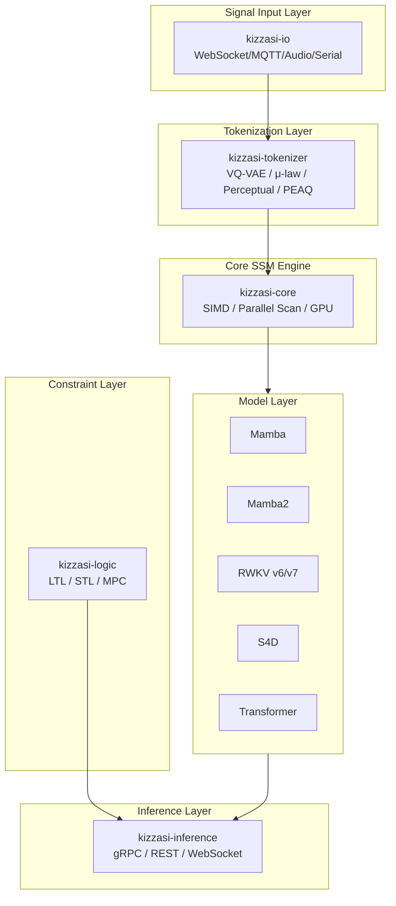
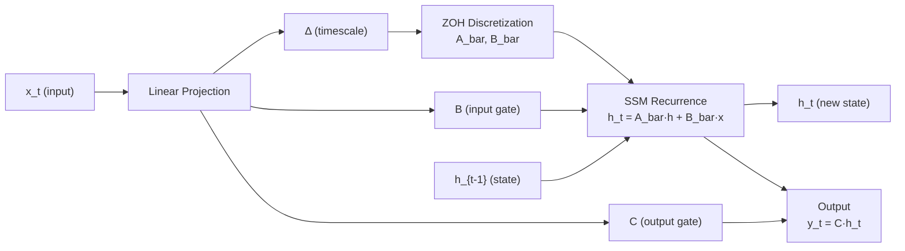
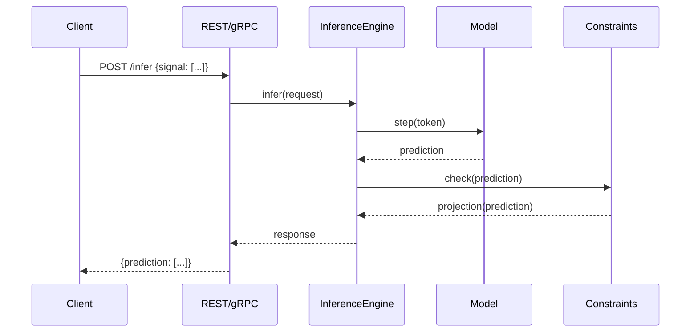
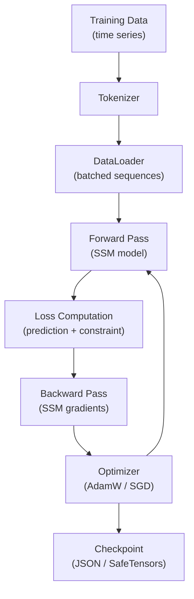

# Kizzasi (兆し)

**Autoregressive General-Purpose Signal Predictor (AGSP)**

[](https://crates.io/crates/kizzasi)
[](https://docs.rs/kizzasi)
[](LICENSE)
[](https://www.rust-lang.org/)

*"Predicting the flux of the world with the precision of logic."*

---

## Overview

**Kizzasi** (Japanese: 兆し, meaning "sign/omen/premonition") is a Rust-native autoregressive predictor designed for **continuous signal streams**—audio waveforms, sensor data, robotics control signals, and video frames. Unlike traditional Large Language Models (LLMs) that operate on discrete text tokens, Kizzasi is purpose-built for the continuous domain.

### The AGSP Paradigm

The term "Language Model" is a misnomer—what we actually have are **General-Purpose Signal Predictors**. Kizzasi embraces this insight:

- **Text tokens** are just one type of signal (discrete vocabulary indices)
- **Audio samples** are continuous signals (44.1kHz waveforms)
- **Sensor readings** are multivariate time series
- **Video frames** are high-dimensional spatial-temporal signals

All these modalities can be processed by the same autoregressive architecture: *predict the next value(s) based on history*.

### Core Innovation: Neuro-Symbolic Architecture

Kizzasi combines the **learning capability** of State Space Models (Mamba/RWKV/S4) with the **strict reliability** of TensorLogic constraints. This ensures predicted signals:

1. Follow statistical likelihoods (learned from data)
2. Adhere to physical laws (conservation, causality)
3. Respect safety constraints (bounds, rate limits)
4. Satisfy logical rules (domain-specific requirements)

---

## Architecture

```
┌─────────────────────────────────────────────────────────────────────────────────┐
│                                    kizzasi                                       │
│                              (Unified Facade API)                                │
├─────────────┬──────────────┬──────────────┬──────────────┬──────────────────────┤
│ kizzasi-    │  kizzasi-    │  kizzasi-    │  kizzasi-    │     kizzasi-io       │
│   core      │    model     │  tokenizer   │  inference   │  (World Connectors)  │
│  (Engine)   │   (Archs)    │  (Encoding)  │  (Pipeline)  │                      │
├─────────────┴──────────────┴──────────────┴──────────────┤                      │
│                       kizzasi-logic                       │                      │
│                  (Constraint Enforcement)                 │                      │
├───────────────────────────────────────────────────────────┴──────────────────────┤
│                            COOLJAPAN Ecosystem                                   │
│            scirs2-core  |  scirs2-signal  |  tensorlogic  |  candle              │
└──────────────────────────────────────────────────────────────────────────────────┘
```

### System Overview



### Mamba SSM Forward Pass



### Inference Pipeline



### Training Data Flow



### Crate Structure

| Crate | Description | Status | SLoC |
|-------|-------------|:------:|------|
| [`kizzasi`](crates/kizzasi) | Unified facade with prelude and ergonomic API | Stable | ~8,200 |
| [`kizzasi-core`](crates/kizzasi-core) | SSM engine, embeddings, SIMD optimizations, parallel scan | Stable | ~19,800 |
| [`kizzasi-model`](crates/kizzasi-model) | Mamba/Mamba2, RWKV v5/v6/v7, S4/S4D, Transformer + training | Stable | ~35,800 |
| [`kizzasi-tokenizer`](crates/kizzasi-tokenizer) | VQ-VAE, μ-law, quantizers, multi-scale tokenization; multi-speaker, perceptual (Bark-scale), PEAQ quality evaluation | Stable | ~17,500 |
| [`kizzasi-inference`](crates/kizzasi-inference) | Pipeline orchestration, sampling, batching, gRPC/REST | Stable | ~12,600 |
| [`kizzasi-logic`](crates/kizzasi-logic) | Constraints, guardrails, projections, LTL/STL | Stable | ~21,400 |
| [`kizzasi-io`](crates/kizzasi-io) | MQTT, Audio, WebSocket, Serial, File, DSP, Beamforming, pure-Rust video (`video-pure`) | Stable | ~22,800 |
| [`kizzasi-embedded`](crates/kizzasi-embedded) | no_std SSM inference for edge devices | Stable | ~2,400 |
| [`kizzasi-python`](crates/kizzasi-python) | Python bindings via PyO3/maturin | Alpha | ~3,200 |
| [`kizzasi-macros`](crates/kizzasi-macros) | Procedural macros for compile-time config | Stable | ~1,050 |
| [`kizzasi-metal`](crates/kizzasi-metal) | Target-gated activation of candle's Apple Metal backend | Stable | ~60 |
| [`kizzasi-webgpu`](crates/kizzasi-webgpu) | WebGPU/WGSL GPU acceleration kernels (SSM scan, matvec, SiLU, RMS-norm) | Alpha | ~2,500 |

**Total: ~147,000+ lines of Rust code across 438 source files**

`Stable` crates are feature-complete and well-tested; `Alpha` crates (kizzasi-python, kizzasi-webgpu) are functional with test coverage but their APIs may still change.

---

## Installation

Add to your `Cargo.toml`:

```toml
[dependencies]
kizzasi = "0.2"
```

### Feature Flags

| Feature | Description | Default |
|---------|-------------|:-------:|
| `std` | Standard library support | ✓ |
| `full` | Enable all features below | ✓ |
| `io` | Physical world connectors | ✓ |
| `logic` | TensorLogic constraints | ✓ |
| `mqtt` | MQTT client over plain TCP (rumqttc) | ✓ |
| `async` | Async/streaming support (tokio) | ✓ |
| `config-files` | TOML/YAML config loading | ✓ |
| `macros` | `#[derive(KizzasiConfig)]` and friends (kizzasi-macros) | ✓ |
| `webgpu` | GPU SSM scan via `kizzasi-webgpu` (wgpu: Metal/Vulkan/DX12) | ○ |
| `metal` | candle Metal backend, live on Apple targets only (propagates to kizzasi-core) | ○ |
| `audio` | Live audio device I/O via cpal — **links a C library** (see below) | ○ |

All of the above default-on features are pulled in transitively through `full`, which is itself part of `default`. The lower-level `kizzasi-model` crate has its own architecture features (`mamba`, `rwkv`, `s4`, `transformer`, all default-on there) for the standalone model implementations used via `kizzasi-inference`'s registry — they are not features of the `kizzasi` facade crate itself.

### Pure Rust: what is and is not in the default build

The default build compiles no C/C++/Fortran of kizzasi's own choosing. Everything that needs a native library is opt-in and named as such:

| Feature | Crate | Native library it pulls in |
|---------|-------|----------------------------|
| `audio` | `kizzasi-io` | cpal → `alsa-sys`/libasound on Linux (CoreAudio via objc2 on Apple, WASAPI on Windows) |
| `video` | `kizzasi-io` | `ffmpeg-next` → the FFmpeg libraries |
| `qp-solver` | `kizzasi-logic` | `osqp` → the OSQP C solver |
| `hf-hub` | `kizzasi-model` | reqwest → rustls → `aws-lc-sys` |

`hdf5` is no longer in this table: it now depends on [`oxih5`](https://crates.io/crates/oxih5), a
pure-Rust HDF5 reader/writer, so it compiles no C at all (the old `hdf5` crate → libhdf5 binding is
gone).

`kizzasi-io` also has a pure-Rust alternative to `video`: the opt-in `video-pure` feature (the
OxiMedia stack) decodes Y4M files and captures from cameras with no C linked at all, so it is
deliberately not a row in the table above. See `crates/kizzasi-io/README.md`'s Cargo Feature Flags
table for exactly what it does and does not decode.

The default build compiles no C at all -- for anyone depending on the published crates, not just inside this workspace. The last holdout was the tensor backend: upstream `candle-core`'s mandatory `tokenizers` dependency selects the `onig` feature, pulling in Oniguruma (`onig`/`onig_sys`, a C regex library), with no configuration lever inside kizzasi to drop it -- candle-core was already built with `default-features = false` here.

kizzasi therefore depends on [`oxicandle-core`](https://crates.io/crates/oxicandle-core) and [`oxicandle-nn`](https://crates.io/crates/oxicandle-nn), the COOLJAPAN fork of candle 0.11.0, which selects `tokenizers`'s pure-Rust `fancy-regex` backend instead (upstream candle PR #3790). The fork keeps the upstream library names, so `use candle_core::…` is unchanged and no kizzasi source file differs because of it. `deny.toml` bans `onig`/`onig_sys` outright, so a regression fails the build rather than passing quietly.

An earlier revision handled this with a `[patch.crates-io]` entry pointing at a sibling candle checkout. That was dropped because it only ever fixed the build *here*: `[patch]` does not propagate to crates.io, so consumers of a published kizzasi crate still compiled `onig`. If you want to check the property that actually matters, check it from outside this workspace, against the published crate:

```bash
cargo new /tmp/kz-consumer && cd /tmp/kz-consumer
cargo add kizzasi-core
cargo tree -i onig      # must report no matching packages
```

If upstream candle ever drops the `onig` default, the fork stops being necessary and these dependencies go back to plain `candle-core`/`candle-nn`.

There is no `cuda` feature. candle's CUDA backend needs an NVIDIA toolkit at build time (its build scripts abort without one) and Cargo cannot make a feature conditional on the host toolchain, so a `cuda` flag would break `--all-features` on every machine without CUDA. Portable GPU acceleration is the `webgpu` feature; on Apple hardware `metal` forwards candle's own Metal backend.

`metal` has the same shape of problem — candle's Metal backend pulls `objc2`, which `compile_error!`s off Apple — but the *target* is something Cargo does know, unlike the presence of a CUDA toolkit. So `metal` is routed through the [`kizzasi-metal`](crates/kizzasi-metal) crate, which declares candle under `cfg(target_vendor = "apple")` and `cfg(not(target_vendor = "apple"))` tables; `resolver = "2"` ignores the features of a platform-specific dependency for targets it is not building. The result is that `--all-features` builds and tests on Linux and Windows, while the backend itself stays Apple-only. Turning `metal` on off-Apple is inert but never silent: `is_metal_available()` returns `false` and `DeviceType::Metal` returns a device error naming the target rather than a CPU device in disguise.

Minimal installation:
```toml
kizzasi = { version = "0.2", default-features = false, features = ["std"] }
```

---

## Quick Start

### Basic Prediction

```rust
use kizzasi::prelude::*;

fn main() -> KizzasiResult<()> {
    // Configure predictor with Mamba2 backend
    let config = KizzasiConfig::new()
        .model_type(ModelType::Mamba2)
        .input_dim(3)
        .output_dim(3)
        .hidden_dim(256)
        .state_dim(16)
        .num_layers(4)
        .context_window(8192);

    let mut predictor = Kizzasi::new(config)?;

    // Single step prediction (O(1) complexity)
    let input = array![0.1, 0.2, 0.3];
    let output = predictor.step(&input)?;

    println!("Predicted: {:?}", output);
    Ok(())
}
```

See [`crates/kizzasi/examples/getting_started.rs`](crates/kizzasi/examples/getting_started.rs) for a step-by-step tutorial covering tokenization, inference, and constraint enforcement.

### With Safety Constraints

```rust
use kizzasi::prelude::*;

fn main() -> KizzasiResult<()> {
    let config = KizzasiConfig::new()
        .model_type(ModelType::Rwkv)
        .input_dim(3)
        .output_dim(3);

    let mut predictor = Kizzasi::new(config)?;

    // Define safety constraints: each ConstraintBuilder produces exactly one
    // bound on one dimension.
    let velocity_limit = ConstraintBuilder::new()
        .name("velocity_limit")
        .dimension(0)
        .in_range(-1.0, 1.0) // Clamp to [-1, 1]
        .weight(1.0)
        .build()?;

    let max_value_limit = ConstraintBuilder::new()
        .name("max_value_limit")
        .dimension(1)
        .less_than(100.0) // Max value < 100
        .weight(1.0)
        .build()?;

    let mut guardrails = GuardrailSet::new();
    guardrails.add_dimensional(0, Guardrail::new(velocity_limit, false));
    guardrails.add_dimensional(1, Guardrail::new(max_value_limit, false));

    predictor.set_guardrails(guardrails);

    // Predictions automatically satisfy constraints
    let input = array![0.5, 0.5, 0.5];
    let safe_output = predictor.step(&input)?;

    println!("Safe output: {:?}", safe_output);
    Ok(())
}
```

Rate-of-change limits use a structurally different type, `TemporalConstraint` (see the Constraint System section below) — it is not accepted by `Guardrail::new`, which takes a single-bound `Constraint`.

### Real-Time Audio Processing

```rust
use kizzasi::prelude::*;
use kizzasi::{AudioConfig, AudioInput};

fn main() -> KizzasiResult<()> {
    // Use the audio preset for an optimized configuration (fixed 44.1kHz, mono)
    let mut predictor = KizzasiBuilder::audio_preset().build()?;

    // Stream from microphone
    let audio_config = AudioConfig::new()
        .sample_rate(44100)
        .channels(1)
        .buffer_size(1024);

    let mut audio = AudioInput::new(audio_config)?;
    audio.start()?;

    loop {
        let buffer = audio.read()?;
        for sample in buffer.iter() {
            let _prediction = predictor.step(&array![*sample])?;
            // Use prediction for audio effect, anomaly detection, etc.
        }
    }
}
```

### Multi-Step Prediction

```rust
use kizzasi::prelude::*;

fn main() -> KizzasiResult<()> {
    let config = KizzasiConfig::new()
        .model_type(ModelType::S4)
        .input_dim(6)
        .output_dim(6);

    let mut predictor = Kizzasi::new(config)?;

    // Predict N steps into the future — returns an Array2<f32> of shape (n_steps, output_dim)
    let initial = array![0.0, 0.0, 0.0, 1.0, 0.0, 0.0];
    let trajectory = predictor.predict_n(&initial, 100)?;

    println!("Predicted {} future states", trajectory.nrows());
    Ok(())
}
```

---

## Model Architectures

Kizzasi supports multiple state-of-the-art sequence modeling architectures:

| Model | Per-Step Complexity | State Size | Best For |
|-------|:-------------------:|:----------:|----------|
| **Mamba2** | O(1) | O(d·N) | Default choice, balanced |
| **RWKV** | O(1) | O(d) | Lightweight, fast |
| **S4D** | O(1) | O(d·N) | Smooth dynamics |
| **Transformer** | O(L) | O(L·d) | Baseline comparison |

### Architecture Selection Guide

`kizzasi_core::ModelType` (used by `KizzasiConfig`/`Kizzasi`) has four variants:

```rust
use kizzasi::prelude::*;

fn main() {
    // High-performance, long context (default choice)
    let _default_choice = ModelType::Mamba2; // Selective SSM with SSD

    // Lightweight, embedded systems
    let _lightweight = ModelType::Rwkv; // Linear attention, minimal state

    // Smooth signal dynamics
    let _smooth_dynamics = ModelType::S4; // HiPPO initialization, structured state space

    // Original selective SSM
    let _baseline = ModelType::Mamba; // First-generation selective SSM
}
```

S4D (diagonal-state S4) and Transformer are also implemented, but as standalone architectures in the lower-level `kizzasi-model` crate (`kizzasi_model::s4::S4D`, `kizzasi_model::transformer::Transformer`) used via `kizzasi-inference`'s model registry for research/comparison — they are not selectable through the top-level `Kizzasi` facade's `ModelType`.

---

## Constraint System

### Constraint Types

| Type | Description | Example |
|------|-------------|---------|
| `Range(min, max)` | Value in [min, max] | Joint angles |
| `LessThan(max)` | Upper bound | Velocity limits |
| `GreaterThan(min)` | Lower bound | Minimum pressure |
| `RateLimit(delta)` | Max change per step | Smooth motion |
| `Linear(a, b)` | a·x ≤ b | Conservation laws |
| `Quadratic(Q, c, b)` | x'Qx + c'x ≤ b | Energy bounds |
| `Temporal(LTL)` | Always/Eventually/Until | Safety properties |

### Training Integration

Constraints can be enforced during training as differentiable losses:

```rust
use kizzasi_logic::{
    ConstraintAwareLoss, ConstraintBuilder, LagrangianRelaxation, LogicResult, PenaltyFunction,
};

fn main() -> LogicResult<()> {
    let velocity_limit = ConstraintBuilder::new()
        .name("velocity_limit")
        .dimension(0)
        .in_range(-1.0, 1.0)
        .weight(1.0)
        .build()?;

    // Combine task loss with constraint violation penalty
    let loss_fn = ConstraintAwareLoss::new(vec![velocity_limit.clone()], PenaltyFunction::L2, 0.1);
    let prediction = [1.5_f32, 0.2, 0.3];
    let mse_loss = 0.05_f32;
    let total_loss = loss_fn.compute_loss(&prediction, mse_loss);

    // Or use Lagrangian relaxation for adaptive weighting
    let mut relaxation = LagrangianRelaxation::new(1).with_multiplier_lr(0.01);
    relaxation.update_multipliers(&prediction, &[velocity_limit]);

    println!("total_loss = {total_loss}");
    Ok(())
}
```

---

## Tokenization Strategies

Kizzasi provides multiple signal-to-token conversion strategies:

| Tokenizer | Type | Vocab Size | Best For |
|-----------|:----:|:----------:|----------|
| `ContinuousTokenizer` | Continuous | ∞ | Default, floating-point signals |
| `VQVAETokenizer` | Discrete | Configurable | Learned codebooks |
| `MuLawCodec` | Discrete | 256/65536 | Audio compression |
| `LinearQuantizer` | Discrete | 2^bits | Simple quantization |
| `MultiScaleTokenizer` | Hierarchical | Variable | Multi-resolution |
| `PyramidTokenizer` | Residual | Variable | Progressive refinement |

`kizzasi-tokenizer` is a separate crate dependency (not re-exported by the `kizzasi` facade), and `VQConfig`/`VQVAETokenizer` require the `vqvae` feature (`kizzasi-tokenizer = { version = "0.2", features = ["vqvae"] }`):

```rust
use kizzasi_tokenizer::{Array1, SignalTokenizer, VQConfig, VQVAETokenizer};

fn main() -> Result<(), Box<dyn std::error::Error>> {
    // Create VQ-VAE tokenizer with 1024 codebook entries
    let config = VQConfig {
        codebook_size: 1024,
        embed_dim: 256,
        ema_decay: 0.99,
        ..Default::default()
    };

    let input_dim = 64;
    let tokenizer = VQVAETokenizer::new(input_dim, config);

    let signal = Array1::from_vec(vec![0.1_f32; input_dim]);
    let tokens = tokenizer.encode(&signal)?;
    let reconstructed = tokenizer.decode(&tokens)?;

    println!("Reconstructed {} values", reconstructed.len());
    Ok(())
}
```

---

## Use Cases

### 1. Robotics Control

Real-time motor control with safety bounds:

```rust
use kizzasi::prelude::*;

fn joint_limits() -> LogicResult<Guardrail> {
    let c = ConstraintBuilder::new()
        .name("joint_limits")
        .in_range(-3.14, 3.14)
        .weight(1.0)
        .build()?;
    Ok(Guardrail::new(c, true))
}

fn velocity_limits() -> LogicResult<Guardrail> {
    let c = ConstraintBuilder::new()
        .name("velocity_limits")
        .less_eq(5.0)
        .weight(1.0)
        .build()?;
    Ok(Guardrail::new(c, true))
}

fn torque_limits() -> LogicResult<Guardrail> {
    let c = ConstraintBuilder::new()
        .name("torque_limits")
        .in_range(-50.0, 50.0)
        .weight(1.0)
        .build()?;
    Ok(Guardrail::new(c, false))
}

fn main() -> KizzasiResult<()> {
    // Built directly rather than via KizzasiBuilder::robotics_preset(axes): that preset
    // fixes input_dim == output_dim (and a lighter hidden_dim/state_dim/num_layers tuning),
    // which doesn't fit this use case's asymmetric 12-in/6-out shape.
    let config = KizzasiConfig::new()
        .model_type(ModelType::Mamba2)
        .input_dim(12)  // 6 joint positions + 6 velocities
        .output_dim(6); // 6 torque commands

    let mut predictor = Kizzasi::new(config)?;

    let mut guardrails = GuardrailSet::new();
    guardrails.add_global(joint_limits()?);    // Physical joint ranges
    guardrails.add_global(velocity_limits()?); // Maximum angular velocities
    guardrails.add_global(torque_limits()?);   // Actuator saturation

    predictor.set_guardrails(guardrails);

    let state = Array1::from_elem(12, 0.0_f32);
    let torques = predictor.step(&state)?;
    println!("Torque commands: {:?}", torques);
    Ok(())
}
```

### 2. Industrial Anomaly Detection

Predictive maintenance for IoT sensors:

```rust
use kizzasi::prelude::*;

fn main() -> KizzasiResult<()> {
    let mut predictor = KizzasiBuilder::sensor_preset(32).build()?; // 32 sensor channels

    // Train on "normal" operation data (training loop not shown)
    // At runtime, large prediction errors indicate anomalies
    let sensor_reading = Array1::from_elem(32, 0.0_f32);
    let actual = Array1::from_elem(32, 0.02_f32);

    let prediction = predictor.step(&sensor_reading)?;
    let anomaly_score = (prediction - actual).mapv(|x| x.abs()).sum();

    println!("Anomaly score: {anomaly_score}");
    Ok(())
}
```

### 3. Audio Synthesis

Next-sample prediction for audio effects:

```rust
use kizzasi::prelude::*;

fn main() -> KizzasiResult<()> {
    let mut predictor = KizzasiBuilder::audio_preset()
        .model_type(ModelType::Rwkv) // Fast, lightweight
        .build()?;

    let input_audio = vec![0.1_f32, 0.2, -0.1, 0.05, 0.0];
    let mut output_audio = Vec::with_capacity(input_audio.len());

    // WaveNet-style sample-by-sample generation
    for sample in input_audio.iter() {
        let next_sample = predictor.step(&array![*sample])?;
        output_audio.push(next_sample[0]);
    }

    println!("Generated {} samples", output_audio.len());
    Ok(())
}
```

### 4. Video Frame Prediction

Anime in-betweening and frame interpolation:

```rust
use kizzasi::prelude::*;

fn bone_length_constraints() -> LogicResult<Guardrail> {
    let c = ConstraintBuilder::new()
        .name("bone_length")
        .in_range(0.0, 2.0)
        .weight(1.0)
        .build()?;
    Ok(Guardrail::new(c, false))
}

fn joint_angle_limits() -> LogicResult<Guardrail> {
    let c = ConstraintBuilder::new()
        .name("joint_angle")
        .in_range(-3.14, 3.14)
        .weight(1.0)
        .build()?;
    Ok(Guardrail::new(c, false))
}

fn main() -> KizzasiResult<()> {
    let config = KizzasiConfig::new()
        .model_type(ModelType::Mamba2)
        .input_dim(1024)  // Frame embedding dimension
        .output_dim(1024);

    let mut predictor = Kizzasi::new(config)?;

    // Enforce skeleton/pose constraints on the predicted frame embedding
    let mut guardrails = GuardrailSet::new();
    guardrails.add_global(bone_length_constraints()?);
    guardrails.add_global(joint_angle_limits()?);
    predictor.set_guardrails(guardrails);

    let frame = Array1::from_elem(1024, 0.0_f32);
    let next_frame = predictor.step(&frame)?;
    println!("Predicted frame with {} features", next_frame.len());
    Ok(())
}
```

---

## Performance

### Inference Characteristics

| Metric | Mamba2 | RWKV | S4D | Transformer |
|--------|:------:|:----:|:---:|:-----------:|
| Per-step complexity | O(1) | O(1) | O(1) | O(L) |
| Memory (state) | O(d·N) | O(d) | O(d·N) | O(L·d) |
| Context length | Unlimited | Unlimited | Unlimited | Fixed L |
| Training parallel | ✓ | ✓ | ✓ | ✓ |

Per-step complexity and memory scaling are analytic properties of each architecture class. Wall-clock latency is hardware- and configuration-dependent and has not been benchmarked on release hardware for this version; `cargo bench` runs the real Criterion suite (see `crates/kizzasi-model/benches/architecture_comparison.rs` for a single-step latency sweep across architectures and hidden dimensions) if you want numbers for your own machine.

### Optimization Features

- **SIMD Vectorization**: Optimized dot products, layer norms, softmax
- **Parallel Scan**: O(log N) depth parallel SSM scan
- **Memory Pooling**: Reusable array allocations
- **Batch Processing**: Efficient multi-sequence inference
- **Continuous Batching**: Dynamic batch formation for streaming

---

## COOLJAPAN Ecosystem

Kizzasi is part of the COOLJAPAN scientific computing ecosystem:

| Crate | Purpose |
|-------|---------|
| [scirs2-core](https://crates.io/crates/scirs2-core) | Array operations, random, SIMD |
| [scirs2-signal](https://crates.io/crates/scirs2-signal) | Signal processing algorithms |
| [scirs2-fft](https://crates.io/crates/scirs2-fft) | Fast Fourier Transform |
| [scirs2-linalg](https://crates.io/crates/scirs2-linalg) | Linear algebra |
| [scirs2-series](https://crates.io/crates/scirs2-series) | Time-series utilities |
| [tensorlogic-ir](https://crates.io/crates/tensorlogic-ir) | Neuro-symbolic constraints |
| [candle-core](https://crates.io/crates/candle-core) | ML backend (GPU acceleration) |
| [oxifft](https://crates.io/crates/oxifft) | Fast Fourier Transform |
| [oxicode](https://crates.io/crates/oxicode) | Binary serialization |
| [oxirs-core](https://crates.io/crates/oxirs-core) / [oxirs-gql](https://crates.io/crates/oxirs-gql) | RDF/GraphQL data layer |
| [wgpu](https://crates.io/crates/wgpu) | GPU compute backend |

See [KIZZASI_POLICY.md](KIZZASI_POLICY.md) for dependency guidelines.

---

## Project Statistics

```
===============================================================================
 Language            Files        Lines         Code     Comments       Blanks
===============================================================================
 Dockerfile              1           53           26           14           13
 JavaScript              1          142          104           18           20
 Makefile                1          191          135           28           28
 Python                  8          984          687           79          218
 Shell                   4          384          276           51           57
 TOML                   16         1619          810          676          133
 YAML                    1           41           38            0            3
-------------------------------------------------------------------------------
 HTML                    2           96           88            0            8
 |- CSS                  2          103          103            0            0
 |- JavaScript           2          266          209           22           35
 (Total)                            465          400           22           43
-------------------------------------------------------------------------------
 Jupyter Notebooks       3            0            0            0            0
 |- Markdown             3          169            1          127           41
 |- Python               3          688          538           54           96
 (Total)                            857          539          181          137
-------------------------------------------------------------------------------
 Markdown               41        12362            0         9537         2825
 |- BASH                16          219          131           57           31
 |- Dockerfile           1           19           19            0            0
 |- Python               3          277          189           31           57
 |- Rust                28         3007         2142          382          483
 |- TOML                19          129          100           20            9
 |- YAML                 1           27           25            0            2
 (Total)                          16040         2606        10027         3407
-------------------------------------------------------------------------------
 Rust                  438       215697       170202        13758        31737
 |- Markdown           436        32033          917        26463         4653
 (Total)                         247730       171119        40221        36390
===============================================================================
 Total                 516       231569       172366        24161        35042
===============================================================================

Tests: 3,688 passing, 24 skipped (workspace, all-features) | Clippy: 0 warnings | Rustdoc: 0 warnings (strict)
```

---

## Contributing

Contributions are welcome! Please open an issue or pull request on [GitHub](https://github.com/cool-japan/kizzasi).

### Development Setup

```bash
git clone https://github.com/cool-japan/kizzasi
cd kizzasi
cargo build --all-features
cargo test --all-features
```

### Code Quality

```bash
# Format
cargo fmt

# Lint
cargo clippy --all-features

# Benchmarks
cargo bench

# Documentation
cargo doc --all-features --no-deps
```

---

## Sponsorship

Kizzasi is developed and maintained by **COOLJAPAN OU (Team Kitasan)**.

If you find Kizzasi useful, please consider sponsoring the project to support continued development of the Pure Rust ecosystem.

[](https://github.com/sponsors/cool-japan)

**[https://github.com/sponsors/cool-japan](https://github.com/sponsors/cool-japan)**

Your sponsorship helps us:
- Maintain and improve the COOLJAPAN ecosystem
- Keep the entire ecosystem (OxiBLAS, OxiFFT, SciRS2, etc.) 100% Pure Rust
- Provide long-term support and security updates

## License

Licensed under the Apache License, Version 2.0 ([LICENSE](LICENSE) or http://www.apache.org/licenses/LICENSE-2.0).

---

## Acknowledgments

- The COOLJAPAN ecosystem contributors
- Mamba/S4 research teams at CMU and Princeton
- RWKV community
- The Rust ML ecosystem (candle, burn)

---

*Kizzasi: Sensing the future, one prediction at a time.*
