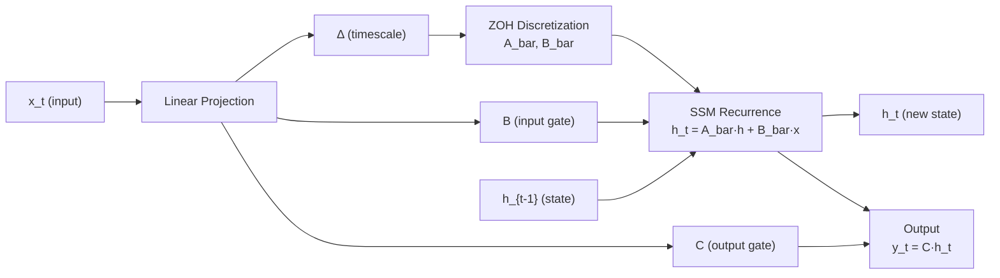

# kizzasi-model

[](https://github.com/cool-japan/kizzasi)
[](Cargo.toml)
[](LICENSE)

Model architectures for Kizzasi AGSP - Mamba, RWKV, S4, Transformer.

## Overview

Production-ready implementations of state-of-the-art sequence models with unified interfaces. All models support O(1) recurrent inference for streaming applications.

**Scale:** 756 tests passing (18 ignored, `--all-features`).

## Features

- **Mamba & Mamba2**: Selective state space models with SSD
- **RWKV v5/v6/v7**: Receptance Weighted Key Value architecture
- **S4/S4D/S5**: Structured state space models with HiPPO initialization
- **H3**: Hungry Hungry Hippos with shift SSMs
- **Transformer**: KV-cache optimized attention
- **Hybrid**: Combined Mamba + Attention architectures
- **MoE**: Mixture of Experts layer with routing strategies
- **Spiking Neural Networks**: LIF neurons with STDP learning and configurable reset modes
- **GGUF Loading**: Dequantization for F16/F32/BF16, legacy Q4_0/Q4_1/Q5_0/Q5_1/Q8_0 and K-quants (Q2K–Q6K, Q8K), byte-exact with `ggml`'s block layouts, plus spec-compliant data-section alignment (`general.alignment`). IQ-series and Q8_1 tensors are parsed and reported but **not** dequantized — check `GgufInspection::is_fully_supported()` (or the per-tensor `tensor_supported` flags) before loading, and `dequantize` returns a typed error for them
- **Checkpoint Loading**: SafeTensors, sharded PyTorch `.pth` conversion, and HuggingFace Hub downloads (Hub client behind the `hf-hub` feature — **not pure Rust**: reqwest's TLS stack compiles `aws-lc-sys`, which is why it is opt-in)

### Architecture features

`default = ["std", "all-models"]`, so nothing is lost by upgrading. Each
architecture feature really gates compilation — turning one off removes those
modules, their `ModelFactory` constructors, and their `profile_all_models`
entries from the build:

| Feature | Modules | `ModelFactory` without it |
|---|---|---|
| `mamba` | `mamba`, `mamba2` | `ModelType::Mamba`/`Mamba2` return `ModelError::unsupported_operation` |
| `rwkv` | `rwkv`, `rwkv5`, `rwkv7` | `ModelType::Rwkv` returns `ModelError::unsupported_operation` |
| `s4` | `s4`, `s5` | `ModelType::S4`/`S4D` return `ModelError::unsupported_operation` |
| `transformer` | `transformer` | `ModelType::Transformer` returns `ModelError::unsupported_operation` |

`h3`, `hybrid`, `moe`, `multimodal`, `neural_ode`, `spiking` and
`temporal_multiscale` have no feature of their own and are always compiled.

## Quick Start

```rust
use kizzasi_model::mamba::{Mamba, MambaConfig};
use kizzasi_model::{Array1, SignalPredictor};

// Create a Mamba model from a size preset (input_dim = 32)
let config = MambaConfig::base(32); // preset: hidden_dim=512, state_dim=16, 6 layers
let mut model = Mamba::new(config)?;

// Single-step O(1) recurrent inference
let input = Array1::<f32>::zeros(32);
let output = model.step(&input)?;

// Or use other size presets (each takes only input_dim)
let tiny_model = Mamba::new(MambaConfig::tiny(32))?;   // For edge devices
let large_model = Mamba::new(MambaConfig::large(64))?; // High accuracy
```

## Supported Models

| Model | Complexity | Memory | Best For |
|-------|------------|--------|----------|
| Mamba2 | O(1) | Low | Real-time streaming |
| RWKV | O(1) | Very Low | Long sequences |
| S4D | O(1) | Low | Continuous signals |
| Transformer | O(n²) | High | Short contexts |
| Hybrid | O(n) | Medium | Balanced performance |

## TensorLogic-IR Integration

v0.2.2 adds symbolic constraint compilation via TensorLogic-IR expressions. Constraints built with `kizzasi-logic`'s `TLExpr` can be compiled to executable `CompiledConstraint` objects for model output validation.

```rust
use kizzasi_model::tensorlogic_bridge::{constraint_from_tl_expr, compile_constraints};
use kizzasi_model::Array1;
use kizzasi_logic::{tl_var, tl_const, TLExpr};

// Compile a single constraint: -1.0 <= output[0] <= 1.0
let lower = TLExpr::Gte(Box::new(tl_var("dim_0")), Box::new(tl_const(-1.0)));
let upper = TLExpr::Lte(Box::new(tl_var("dim_0")), Box::new(tl_const(1.0)));
let expr = TLExpr::And(Box::new(lower), Box::new(upper));
let constraint = constraint_from_tl_expr("output_range", &expr, 1)?;

// Evaluate the compiled constraint against a model output vector
let output = Array1::from_vec(vec![0.5_f32]);
constraint.evaluate(&output)?;

// Batch-compile multiple constraints at once
let seq_bound = TLExpr::Lte(Box::new(tl_var("dim_0")), Box::new(tl_const(512.0)));
let specs = vec![
    ("output_range",  expr,     1),
    ("seq_len_bound", seq_bound, 1),
];
let constraints = compile_constraints(&specs)?;
for c in &constraints {
    c.evaluate(&output)?;
}
```

`constraint_from_tl_expr(name, expr, num_dims)` compiles a single named expression into a `CompiledConstraint`. `compile_constraints` accepts a slice of `(name, TLExpr, num_dims)` tuples and returns all compiled constraints in one call, which is more efficient for validating several invariants simultaneously.

## Mamba SSM Forward Pass



## Documentation

- [API Documentation](https://docs.rs/kizzasi-model)
- [Kizzasi Repository](https://github.com/cool-japan/kizzasi)

## License

Licensed under the Apache License, Version 2.0.
