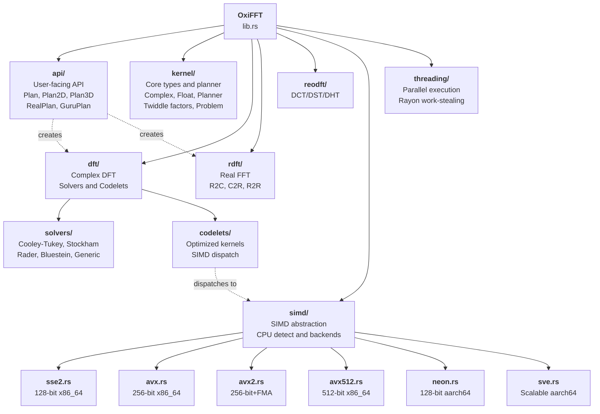
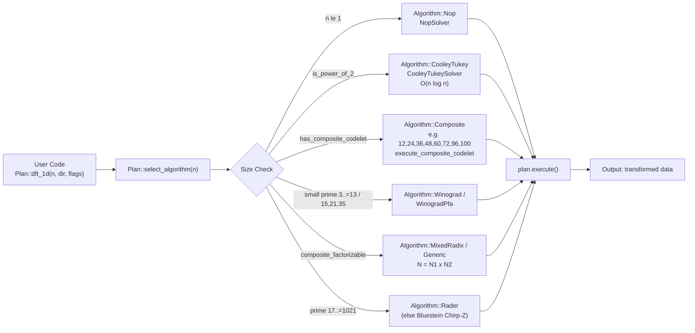
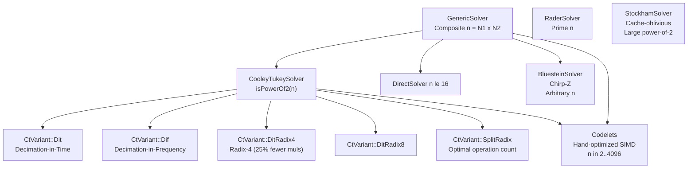
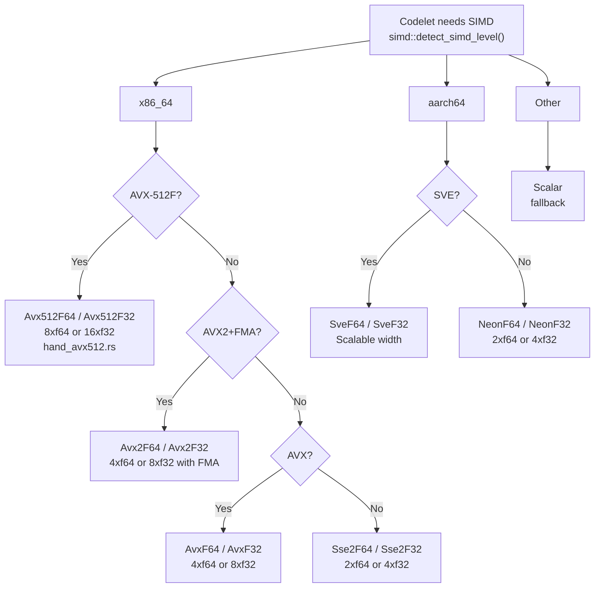

# OxiFFT Architecture Blueprint

## Overview

OxiFFT is a pure-Rust implementation of FFTW3 following its Problem-Plan-Solver design.

## Module Structure

```
oxifft/src/
├── api/            Public user-facing API (Plan, Plan2D, Plan3D, RealPlan, GuruPlan)
├── kernel/         Core planner, data structures, F16/F128 types, twiddle factors
├── dft/            Complex DFT implementations (codelets, solvers, composite)
├── rdft/           Real DFT (R2C, C2R, R2R)
├── reodft/         DCT/DST transforms (Types I-IV, DHT)
├── simd/           SIMD abstraction layer (SSE2, AVX, AVX2, AVX-512, NEON, SVE)
├── threading/      Parallel execution via Rayon
├── support/        Utilities (alignment, transpose, copy operations)
├── sparse/         Sparse FFT (FFAST algorithm, O(k log n))
├── pruned/         Pruned FFT (input/output pruning, Goertzel)
├── streaming/      STFT, window functions, mel filterbank, MFCC
├── signal/         Hilbert transform, Welch PSD, cepstrum, resampling
├── const_fft/      Compile-time FFT with const generics (sizes 2–1024)
├── nufft/          Non-uniform FFT (Type 1/2/3, Gaussian gridding)
├── frft/           Fractional Fourier Transform
├── conv/           FFT-based convolution and correlation
├── autodiff/       Automatic differentiation (forward/backward mode)
├── conv/ ntt/      FFT convolution; number-theoretic transform
├── chirp_z/        Chirp-Z transform
├── compat/         FFTW-compatible (fftw_*) API surface
├── gpu/            GPU acceleration (Metal = real GPU; CUDA = CPU-fallback today)
└── wasm/           WebAssembly bindings
```

> MPI distributed computing is **not** an `oxifft/src/` module — it lives in the
> separate `oxifft-adapter-mpi` crate (system MPI FFI, quarantined out of the
> pure-Rust core).

## Core Types

The public surface is concrete `Send + Sync` plan structs (`Plan`, `Plan2D`,
`Plan3D`, `PlanND`, `RealPlan*`, `R2rPlan*`, `SplitPlan*`, `GuruPlan`). The
internal planning contract centres on `kernel::Problem` and `kernel::Planner`:

```rust
pub trait Problem: Hash + Debug + Clone + Send + Sync { ... }
// Solver selection is driven by `kernel::Planner` + `wisdom::WisdomEntry`;
// there is no public `Plan`/`Solver` trait (the old zero-implementor
// `kernel::Solver` trait was removed in v0.4.0).
```

## Planning System

The planner selects the optimal solver for each problem via the Wisdom cache:

1. Hash the problem (size, direction, flags)
2. Check wisdom cache for a previously measured plan
3. If not cached, run timing trials (MEASURE/PATIENT/EXHAUSTIVE modes)
4. Store the winner in the wisdom cache for future reuse

## Architecture Diagrams

### Overall Module Organization



### Planning and Solver Dispatch



### Solver Hierarchy



### SIMD Runtime Dispatch



## Algorithm Selection

The `ESTIMATE` heuristic (`select_algorithm`) picks as follows; `MEASURE`/
`PATIENT`/`EXHAUSTIVE` instead consult the runtime wisdom cache and, on a miss,
benchmark candidates and cache the winner.

| Transform Size | Algorithm |
|----------------|-----------|
| Power of 2 | Cooley-Tukey DIT (radix-2/4/8, split-radix) |
| Power of 2 (large) | Stockham (cache-friendly, auto-sort) — reachable via measured wisdom |
| Small prime 3–13 | Winograd (hand-optimized) |
| Coprime composite 15/21/35 | Winograd PFA |
| Prime 17–1021 | Rader's algorithm (else Bluestein) |
| Larger prime / arbitrary | Bluestein (Chirp-Z) |
| Composite | Composite codelet, then Mixed-radix, then Generic |
| n ≤ 1 | Nop |

> `Algorithm::Direct` (O(n²)) is **no longer** chosen by the heuristic; it stays
> reachable only through measured or imported wisdom.

## SIMD Architecture

Runtime CPU feature detection selects the best backend. **Reached today** are
the x86_64 (SSE2/AVX/AVX2/AVX-512) and aarch64 NEON tiers, on small fixed-size
codelets and Rader/Bluestein pointwise multiplies, plus the wasm32 `simd128`
tier for the size-2/4/8 codelets (`dft::codelets::simd::wasm_backend`, reached
from `notw_{2,4,8}_dispatch` when compiled with `-C target-feature=+simd128`).
SVE is the one entry below that is still **planned rather than reached**: it is
capability/vector-length detection only, because stable Rust exposes no
scalable-vector intrinsics to build a real SVE kernel with.

- **x86_64**: AVX-512 > AVX2 > AVX > SSE2 > scalar
- **aarch64**: (SVE, planned — no stable intrinsics) > NEON > scalar
- **wasm32**: simd128 (sizes 2/4/8) > scalar
- **other**: scalar fallback

For detailed algorithm citations and implementation notes, see the inline rustdoc comments
in each module.
