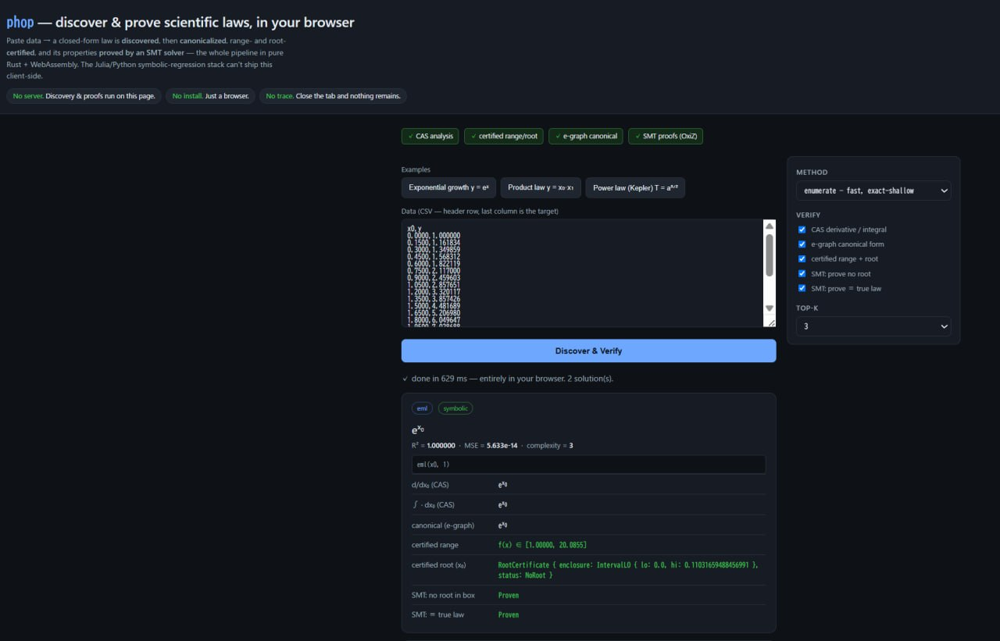
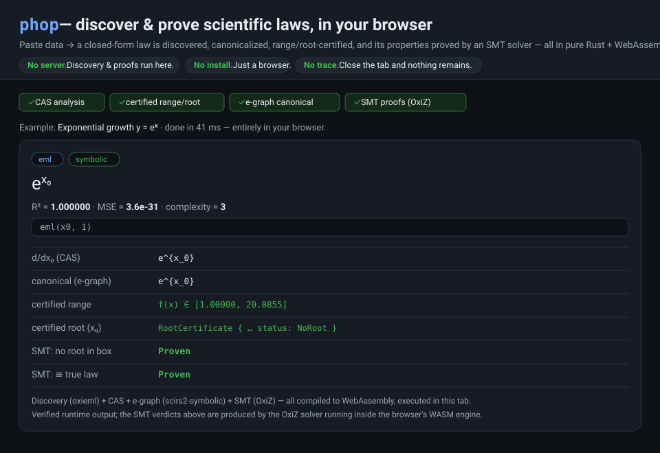

# phop

> **phop** (Thai: พบ — *to discover, to encounter*)
> *Discover the equation. One operator at a time.*

**phop** is a differentiable symbolic-discovery engine written entirely in pure Rust. It
learns both the *topology* and the *numeric parameters* of closed-form expressions by gradient
descent over homogeneous binary trees built from a **single** binary primitive — the EML
operator

```text
eml(x, y) = exp(x) − ln(y)
```

which (Odrzywołek 2026, arXiv:2603.21852) is *functionally complete* for the elementary
functions when combined with the constant `1`. Because every internal node is the **same**
operator, an entire population of candidate expressions can be evaluated inside one
automatic-differentiation graph, and the only remaining categorical choice — *which source
feeds each leaf* — is relaxed with Gumbel-Softmax and descended end-to-end. This is something
conventional symbolic regression (with its heterogeneous operator sets and discrete structure
search) cannot do.

Built on the [SciRS2](https://github.com/cool-japan/scirs) ecosystem
(`scirs2-autograd`, `scirs2-core`) and the [`oxieml`](https://github.com/cool-japan/oxieml)
EML library. No C/FFI dependency.

<p align="center">
  
</p>

<p align="center"><em>phop in the browser (WebAssembly): paste CSV → a closed-form law is discovered, canonicalized, and its properties proved by an SMT solver — the whole pipeline runs client-side, in pure Rust. No server, no install.</em></p>

## 🌐 Browser demo — discover **and prove** laws, with zero server

phop compiles to WebAssembly, and so does its *entire verification stack*. The result
([`crates/phop-wasm`](crates/phop-wasm), npm **`@cooljapan/phop-wasm`**) is a web page that **discovers a
closed-form law, canonicalizes it with a CAS, certifies its range/roots, and proves its properties
with an SMT solver — all in the browser tab, with no backend, no install, and nothing stored.**



The whole pipeline (`oxieml` CAS + `oxiz` SMT solver + `scirs2-symbolic` e-graphs) is pure Rust, so
it ships as one ~0.9 MB (gzipped) WASM module. The Julia/Python symbolic-regression tools have no
browser runtime and cannot do this client-side. See the [demo README](crates/phop-wasm/README.md)
(`./crates/phop-wasm/build-wasm.sh`, then `python3 -m http.server` and open `/www/`).

## Quick start (30 seconds)

```rust
use phop_core::{Config, DataSet, Discoverer};
use scirs2_core::ndarray::{Array1, Array2};

// y = exp(x)
let xs: Vec<f64> = (0..50).map(|i| i as f64 * 0.08).collect();
let x = Array2::from_shape_vec((xs.len(), 1), xs.clone()).unwrap();
let y = Array1::from(xs.iter().map(|v| v.exp()).collect::<Vec<_>>());
let ds = DataSet::from_arrays(x, y).unwrap();

let front = Discoverer::new(Config::default().max_depth(2)).fit(&ds).unwrap();
let best = front.best().unwrap();
println!("{}  (mse = {:.2e})", best.latex(), best.mse);
// => e^{x_{0}}  (mse = 0.00e0)
```

Run the bundled demo:

```bash
cargo run -p phop-examples --example exp_growth
```

## CLI

```bash
cargo run -p phop-cli -- discover data.csv --top-k 5 --format latex
# methods:  enumerate (exact, shallow) | gumbel (diff. topology) | gated (diff. depth) |
#           gated-warm (gated seeded from enumerate) | auto (run all, merge Pareto fronts)
# formats:  --format table | latex | rust | json   (json carries latex/rust/numpy/sympy per row)
# target:   --target <COL>  (0-based index or header name; default = last column)
# features: --features a,c   (subset of feature columns by index or name; default = all non-target)
# output:   --output out.json   --quiet / --verbose
# penalties (gumbel): --lambda-complexity --lambda-sparsity --lambda-parsimony
# backend:  --gpu cuda   (needs a --features gpu-cuda build; see the GPU section below)
```

The last CSV column is the target by default; preceding columns are features. Use `--target` to
pick any column (by index or name) as the target.

## Python

```python
import numpy as np, phop
x = np.linspace(0, 4, 50).reshape(-1, 1)
y = np.exp(x[:, 0])
res = phop.Discoverer(max_depth=2).fit(x, y)
print(res.top_latex(5))
```

Build the wheel with `maturin build -m crates/phop-py/Cargo.toml`.

## Workspace

| Crate | Role |
|-------|------|
| `phop-core` | the engine: guarded EML forward (Layer A), constant fitting (Adam) + Levenberg–Marquardt polish + named-constant snapping, differentiable topology (Gumbel-Softmax) and **depth** (expand/terminate gates), enumerate/gumbel/gated/warm-start/auto discovery, Pareto front, distillation to LaTeX/Rust/NumPy/SymPy, optional CUDA backend |
| `phop-cli` | `phop discover data.csv` (`--method`, `--format`, `--target`/`--features`, `--gpu`) |
| `phop-py` | Python bindings (PyO3 / maturin) |
| `phop-wasm` | WebAssembly (`discover_json`) for in-browser demos |
| `phop-bench` | benchmark harness (criterion + synthetic/Feynman-like suite, recovery + GPU-throughput bins) |
| `phop-examples` | Kepler · Planck · Michaelis–Menten · Black-Scholes · exponential-growth demos |

## How it works

1. **Layer A — Tensorized forest.** An EML tree is evaluated as a batched autograd graph with
   *guarded* `exp`/`ln` (clamped arguments, NaN-safe) so it never overflows or takes `ln` of a
   non-positive number.
2. **Layer B — Differentiable topology.** Over a complete-tree skeleton, each leaf holds
   Gumbel-Softmax logits over its possible sources (the input variables and a learnable
   constant). Temperature is annealed from exploratory to near-discrete; at the end each leaf
   is hardened by `argmax` into a concrete tree. The tree's **depth/shape** can also be learned
   (`discover_gated`): each non-root node carries an expand/terminate gate `σ(z_n)` so subtrees are
   pruned by gradient descent — `eml` has no skip/identity, so a node collapses by *terminating into
   a leaf*, not by a DARTS-style zero-op.
3. **Layer C — Pareto.** Candidates are scored on (accuracy, complexity) and the non-dominated
   front is returned — discovery is *Pareto-first* (a simpler, slightly-worse law is often the
   true one). `Solution::predict(x)` evaluates a recovered law on new data.
4. **Layer D — Distillation.** Constants are sharpened by **Levenberg–Marquardt** and *snapped* to
   named constants (π, e, √2, …) when that does not worsen the fit; the tree is then rendered to
   canonical LaTeX (via `oxieml` lowering + simplification) plus Rust, NumPy, and SymPy.

**Discovery methods** (`phop_core`): `Discoverer::fit` (exact enumeration), `discover_gumbel`
(differentiable topology), `discover_gated` (differentiable depth), `discover_gated_warm` (gated
seeded from the enumeration solution), and `discover_auto` (a **meta-ensemble** — runs all of the
above *plus* the `oxieml` GA/beam/MCTS engine and merges their Pareto fronts).

**Discover → analyze → verify → deploy.** Because a discovered law is a live `oxieml` EML tree (not
a string), the cool-japan CAS applies to it directly:

- **Analyze:** `Solution::analyze` returns the derivative, antiderivative, Maclaurin series, and
  limits (CLI `--analyze`).
- **Canonicalize (e-graph, feature `egraph`):** `Solution::latex_egraph` routes the law through
  `scirs2-symbolic`'s equality-saturation e-graph for **stronger** canonical LaTeX — collapsing forms
  a single-pass simplifier misses (e.g. `ln(exp(x)) → x`), with a graceful fall-back to oxieml's own
  rendering for special functions.
- **Verify (certified):** `Solution::certified_root` returns an interval Newton/Krawczyk
  **certificate** of a root, and `Solution::certified_range` a **sound** interval enclosure of the
  law's range over a box — laws that ship with proofs.
- **Prove (SMT, feature `smt`):** `Solution::prove_{lower_bound,upper_bound,positive,negative,no_root,equivalent}`
  return a `Verdict` (`Proven`/`Counterexample`/`Unknown`) over a box. `Proven` rests on the rigorous
  interval enclosure; **OxiZ** — the cool-japan pure-Rust Z3-replacement SMT solver, via
  `oxieml::smt` — searches for counterexamples (each re-verified by an exact forward pass). This is
  the logical tier between interval-numeric certificates and a machine-checked Lean proof.
- **Machine-check (Lean, feature `lean`):** `lean::prove_eml_one_lowering` hands a proof of phop's
  lowering step `eml(x,1) = exp(x)` to the **OxiLean** kernel (the cool-japan pure-Rust Lean prover);
  the kernel type-checks the rewrite chain (with a negative control proving it isn't a rubber stamp).
  This is *axiom-relative* — checked against a small postulated EML theory, so it is **weaker** than
  the unconditional interval `Verdict::Proven`, not a replacement. (Real-analytic proofs such as
  `a^{3/2} = exp(1.5·ln a)` are out of reach until the ecosystem ships a `Real` exp/log theory.)
- **Dimensional prior:** reduce dimensioned inputs to their Buckingham-π dimensionless groups first
  (`DataSet::to_dimensionless` / `pi_groups`).
- **Dynamical systems:** `discover_ode(series, dt, cfg)` recovers the right-hand side of an
  autonomous ODE `dx/dt = f(x)` from a trajectory.
- **Neuro-symbolic (feature `tensorlogic`):** `Solution::{to_tlexpr, to_tl_weighted_rule,
  to_tl_weighted_equation}` map a discovered law into oxieml's **TensorLogic** IR, so a recovered
  equation can enter a differentiable logic program as a weighted soft constraint.
- **Deploy:** `Solution::compile_rust` emits a canonical standalone Rust function for the law.

**Fit, rank, accelerate.**

- **Robust losses:** `polish_constants_robust(tree, ds, iters, RobustLoss::{Huber{delta}, Trimmed{alpha}})`
  refines constants under outliers via IRLS — the squared penalty of plain MSE lets a few gross
  outliers drag the fit, while Huber caps and Trimmed discards their influence.
- **Library optimizers:** `optimize::polish_constants_scirs(.., ScirsPolish::{Lm, Lbfgs})` offers
  `scirs2-optimize`'s Levenberg–Marquardt and L-BFGS as alternative constant-fit backends (the
  panic-free hand-rolled LM remains the default).
- **Multi-objective Pareto:** `ParetoFront::rank_multiobjective` ranks the front on four objectives —
  accuracy, complexity, interpretability, elegance — via `scirs2-optimize`'s NSGA-III non-dominated
  sort + crowding distance.
- **Parallel sweep (feature `parallel`):** the enumerate topology sweep fans out across cores with
  `scirs2-core`'s order-preserving parallel map (discovery stays deterministic).
- **Portable GPU (feature `gpu-wgpu`):** `accel::gpu_backend()` selects **CUDA → wgpu → CPU**;
  `wgpu_forward::eval_tree_wgpu` runs the EML forward on any hardware wgpu adapter
  (WebGPU/Metal/Vulkan/DX12) by compiling the tree to a single WGSL kernel (f32; the CUDA/CPU paths
  stay f64).

## Status

Working and tested today — `cargo nextest run --workspace --all-features` is green and
`cargo clippy --workspace --all-targets --all-features -- -D warnings` is clean. Implemented:

- the guarded Layer-A forward (matches `oxieml`), Adam constant fitting + LM polish + named-const
  snapping, the Gumbel-Softmax leaf relaxation, and the **expand/terminate gates** that make tree
  *depth* differentiable;
- five discovery entry points (enumerate / gumbel / gated / gated-warm / auto), Pareto fronts with
  `predict`, and distillation to LaTeX / Rust / NumPy / SymPy;
- an optional **CUDA backend** (`gpu-cuda`) — guarded forward, a GPU-resident constant-fit loop with
  reverse-mode analytic gradients, and a GPU Gumbel search (gradient-checked vs finite differences);
- **opt-in tiers** layered on the pure-Rust default: robust losses + `scirs2-optimize` LM/L-BFGS
  polish + NSGA-III multi-objective ranking (default deps); `smt` (OxiZ proofs), `lean` (OxiLean
  proof-carrying), `egraph` (equality-saturation LaTeX), `parallel` (NUMA sweep), `tensorlogic`
  (neuro-symbolic bridge), and a portable `gpu-wgpu` forward;
- front ends: CLI, PyO3 bindings, WASM (`discover_json`), a benchmark harness, and runnable demos.

`exp(x)`, `exp(x)−ln(y)`, and `exp(exp(x))` are recovered **exactly**; warm-started gated recovers
nested structure the cold search misses. Deeper laws (Kepler `a^{3/2}`, Planck) are currently only
*approximated* — but **not because EML cannot express them**. By Odrzywołek's completeness theorem
every elementary function is a finite `eml` tree, and `oxieml` ships the constructions directly:
`a^{3/2} = Canonical::pow(a, 3/2) = exp(1.5·ln a)`, with `mul`/`ln` themselves built from `eml`.
The gap is in *phop*, on three fronts: (1) that tree is a **deep composition** well beyond phop's
bounded-depth search; (2) phop's leaves are a single variable or constant, with no **affine leaf**
`a·xᵢ+b` (a leaf-parameterization choice, not an EML-expressiveness one); and (3) those
constructions are valid on the **complex/principal branch** (negative intermediates such as `ln a`
for `a<1`), whereas phop's `eval_real` forward guards `ln` to positive arguments. The levers are
therefore deeper search, a richer (affine) leaf basis, warm-starting from the `oxieml` construction,
and complex-aware/domain-careful evaluation — see the `TODO.md` files (and the remaining
external/hardware work).

## GPU (CUDA)

An optional CUDA forward-evaluation backend is available behind the `gpu-cuda` feature, built on
the cool-japan [`oxicuda`](https://crates.io/crates/oxicuda) stack. It evaluates an EML tree by
composing an elementwise `eml(a,b) = exp(a) − ln(b)` PTX kernel (loaded via the driver JIT — no
CUDA toolkit needed at runtime, only the driver), with the same numerical guards as the CPU path.

```rust
#[cfg(feature = "gpu-cuda")]
{
    use phop_core::{cuda_available, CudaEmlEngine};
    if cuda_available() {
        let engine = CudaEmlEngine::new().unwrap();
        let pred = engine.eval_tree(&tree, &x).unwrap(); // single-precision GPU forward
    }
}
```

A **GPU-resident constant-fit loop** is also available — `CudaEmlEngine::fit_constants` keeps the
data resident and runs, per step, one on-device forward (atomic sum-of-squared-residuals reduction)
plus one reverse-mode **analytic backward** for the exact gradient of all constants, then Adam
(`constant_grad` exposes the gradient; it is checked against finite differences):

The Gumbel-Softmax topology search also has a GPU-resident path, `discover_gumbel_cuda` (the
softmax over each leaf's sources runs on the host; the weighted leaf combination, the `eml` tree,
and the full reverse-mode backprop run on-device).

```bash
cargo test -p phop-core --features gpu-cuda                       # GPU forward + fit + gumbel (skips if no device)
cargo run  -p phop-bench --features gpu-cuda --release --bin gpu_throughput
```

The on-device math is single precision (`ex2`/`lg2` hardware approximations) for throughput; exact
`f64` scoring stays on the CPU. Verified on an RTX 3060: forward matches CPU to < 1e-3 and ~8× faster
at ≥100k rows; the fit loop runs **~9 ms/epoch at 1M rows**.

## License

Licensed under **Apache-2.0** — see [`LICENSE-APACHE`](LICENSE-APACHE). Dependency-license /
advisory policy lives in `deny.toml` (`cargo deny check`).
