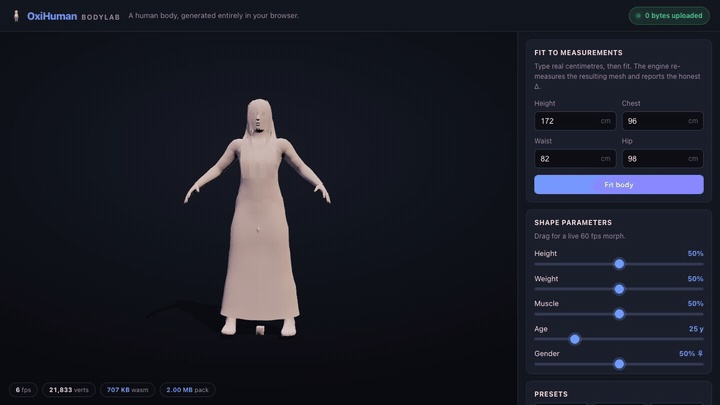
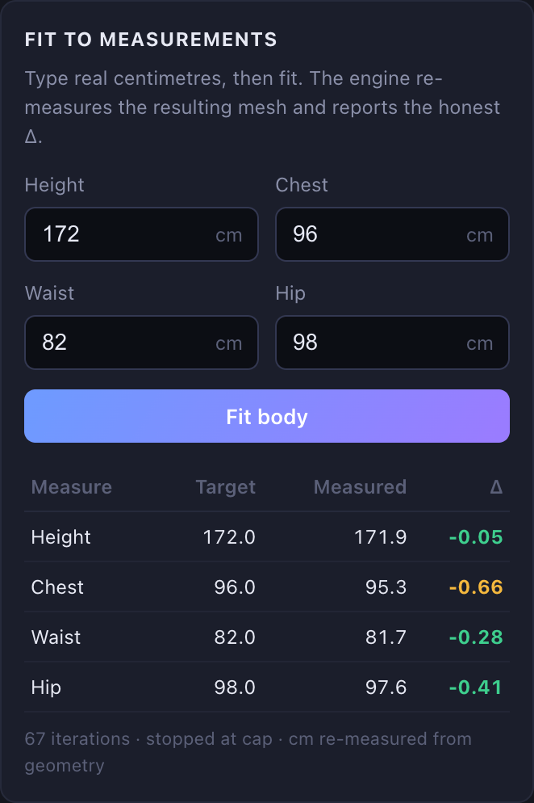
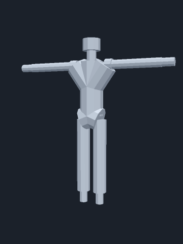
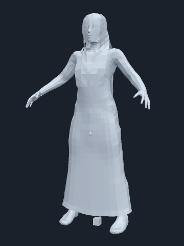
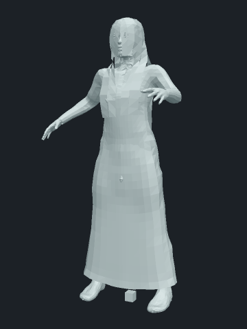

# OxiHuman

**Privacy-first, client-side parametric human body generator — pure Rust, compiled to WebAssembly.**

[](LICENSE)
[](CHANGELOG.md)
[](https://doc.rust-lang.org/edition-guide/rust-2021/)


*The **BodyLab** demo: type real centimetres, press **Fit body**, and read an honest per-measurement Δ re-measured from the generated mesh — all on-device, `0 bytes uploaded`. [Try it below.](#demo)*

> **Version 0.2.2** — Unreleased
> **Author**: COOLJAPAN OU (Team Kitasan)
> **Repository**: https://github.com/cool-japan/oxihuman
> **License**: Apache-2.0 (code) / CC0-1.0 (bundled body-mesh data)

---

## What this is

OxiHuman generates detailed 3D human body meshes from parametric sliders
(height, weight, muscle, age, ...) entirely on the client — in the browser
via WebAssembly, or natively. There is no body-data upload step and no
generation server: unlike hosted avatar services (e.g. Ready Player Me),
there is no server to shut down, rate-limit, or have a data breach on,
because the mesh math never leaves the device it runs on.

Measured, not aspirational, numbers as of this release:

| Metric | Value |
|---|---|
| WASM web build (gzip) | ~208 KB (208.42 KB / 213,418 B, `oxihuman_wasm_bg.wasm`, release + wasm-opt; see [web/bench/README.md](web/bench/README.md#numbers--how-to-reproduce-them)) |
| Core asset pack | `oxihuman-core-v1.ohpk`, 2,093,260 B (≈ 2.00 MB), 38 CC0-licensed morph targets (30 macro-shape corners + 8 `measure/` girth targets), 21,833 base vertices |
| Worst-case quantisation error | 0.011 mm (see [docs/bench/pack-reconstruction-error.md](docs/bench/pack-reconstruction-error.md)) |
| Measurement fit (`brief-172` probe) | \|Δ\| ≤ 0.66 cm, ~0.9 s for a four-measurement fit under Node (see [docs/bench/measurement-error.md](docs/bench/measurement-error.md)) |
| Engine morph cost | p50 ≈ 0.52 ms/frame at 21,833 verts (set_param + refresh_geometry; see [web/bench/README.md](web/bench/README.md)) |

### Core principles

| Principle | Description |
|-----------|-------------|
| **No network by default** | Core crates compile without any HTTP stack; no outbound connections at runtime |
| **Client-side compute** | All morphing and mesh synthesis runs locally — in the browser or on native |
| **Safety by construction** | The base mesh is always a bodysuit; no naked mesh stage exists in memory or exports — see [SAFETY.md](SAFETY.md) |
| **Deterministic builds** | Fully reproducible pipelines for both WASM and native targets |

---

## Quick start (npm / browser)

```js
import init, { OxiHumanEngine } from "oxihuman-wasm";
await init();
const bytes  = new Uint8Array(await (await fetch("./pack/oxihuman-core-v1.ohpk")).arrayBuffer());
const engine = OxiHumanEngine.from_core_pack_bytes(bytes);
engine.set_param("height", 0.7);
```

Then export in-memory (no filesystem — works on wasm32):

```js
const glb = engine.export_glb();       // Uint8Array, GLB 2.0
const vrm = engine.export_vrm();       // Uint8Array, VRM 1.0
const stl = engine.export_stl(true);   // Uint8Array, binary STL (false = ASCII)
const obj = engine.export_obj();       // string, Wavefront OBJ
```

### Zero-copy geometry for three.js / WebGL

```js
import { wasm_memory } from "oxihuman-wasm";
const memory = wasm_memory();
engine.refresh_geometry();
const positions = new Float32Array(memory.buffer, engine.positions_ptr(), engine.positions_len());
// upload `positions` straight into a BufferGeometry/VBO with zero JS-side copies
```

See [crates/oxihuman-wasm/README.md](crates/oxihuman-wasm/README.md) for the
full 68-method API surface, the classic OBJ/ZIP-pack flow, and the Node.js
verification harness.

---

## License

> OxiHuman is an independent, pure-Rust, Apache-2.0 implementation of a
> parametric human body generator. It is *format-compatible* with
> MakeHuman: it reads the documented `.target` and `.mhclo` file formats.
> It contains no code copied, translated, or otherwise derived from the
> AGPL-licensed MakeHuman Python application.

Code is licensed under [Apache-2.0](LICENSE). The bundled body-mesh and
morph-target data assets (`assets/packs/`) are derived from MakeHuman data
released under CC0-1.0; see [PROVENANCE.md](PROVENANCE.md) for the full
upstream chain and [docs/CLEANROOM_AUDIT.md](docs/CLEANROOM_AUDIT.md) for
the clean-room verification methodology. See also [NOTICE](NOTICE).

---

## Safety

The base mesh is always exported wearing a bodysuit — there is no code path
that produces or exports a nude mesh, enforced by an export gate checked on
every export entry point (GLB, VRM, OBJ, STL, COLLADA, USD, 3MF) and a named
regression test. Age is clamped client-side to the pack's declared floor
(18 years for the shipped core pack) before any mesh is built. Details:
[SAFETY.md](SAFETY.md).

---

## Limitations (honest)

OxiHuman's topology and morph targets are MakeHuman-derived realistic human
anatomy — this is not a stylised/anime avatar system, and won't look like
one without new target data. The core pack ships 38 targets (30 macro-shape
corners + 8 `measure/` girth targets; a broader, non-core target set is
available separately, outside this repository's default asset footprint).
Localised girth fitting (chest / waist / hip via the `measure/` targets)
now works end-to-end and closes to sub-centimetre residuals across realistic
adult tape measurements; the `brief-172` probe fits to \|Δ\| ≤ 0.66 cm. The
pack's reachable girth envelope is finite, though: at the extremes (e.g. an
`adult-XL` build) a girth can sit at the envelope edge, leaving up to ≈ 1.44 cm
residual (worst case, `adult-XL` hip). The full per-measurement accuracy is
characterised in
[docs/bench/measurement-error.md](docs/bench/measurement-error.md), not
assumed. There is no clothing or hair in the core pack. The bundled WebGL
demo renders via WebGL, not WebGPU (an optional `webgpu` viewer feature
exists for native/experimental use, but the shipped browser demo does not
depend on it).

---

## Roadmap

- **Own shape space (M6, future)**: replace reliance on MakeHuman-derived
  morph targets with an OxiHuman-native shape space fit from public-domain
  anthropometric survey data (ANSUR II), removing the dependency on any
  third-party body-model shape basis entirely.

---

## Demo

A BodyLab interactive demo lives in [`demo/`](demo/) — parameter sliders,
live preview, measurement fitting, and GLB/VRM/STL/OBJ export straight from the
browser. Every number on the page (WASM + pack transfer sizes, FPS, vertex
count, `0 bytes uploaded`) is measured at runtime, never hardcoded.



### Live demo

Hosted, nothing to install: **[cooljapan.tech/bodylab](https://cooljapan.tech/bodylab/)**
— the BodyLab demo running fully client-side in your browser.

Or run it locally (fully static, no build step at serve time):

```sh
scripts/build_demo.sh          # builds the WASM module into demo/pkg
cd demo && python3 -m http.server 8080
# open http://localhost:8080
```

### Honest measurement fit

Type real centimetres and press **Fit body**: the engine re-measures the
resulting mesh and reports the per-measurement Δ — the *measured* column is read
back from the fitted geometry, never echoed from your input. The `brief-172`
fit (172 / 96 / 82 / 98) closes to |Δ| ≤ 0.66 cm.



> The demo screenshots above are real captures of the page rendered in headless
> Chrome; the on-screen FPS chip reads low only because that capture ran on a
> software (SwiftShader) rasteriser with no GPU — on real hardware the morph
> runs at 60 fps (p50 ≈ 0.52 ms/frame, see [`web/bench/`](web/bench/README.md)).

---

## The base mesh, rigged

The shipped 21,833-vertex base mesh with `Skeleton::human_body()` fitted onto
it, skinned, and deformed a frame at a time. Every frame below is real output,
rendered offline from the same rest mesh, bone weights and per-frame skinning
matrices the GLB exporter writes — not a re-simulation for the picture.

<table>
<tr>
<td align="center" width="33%">

</td>
<td align="center" width="33%">

</td>
<td align="center" width="33%">

</td>
</tr>
<tr>
<td align="center"><sub><b>Rig only</b> — a synthesized tube body, <i>not</i>
OxiHuman geometry, so the skeleton and the motion can be read without the mesh
in the way.</sub></td>
<td align="center"><sub><b>Base mesh, imported motion</b> — the shipped pack
driven by a BVH clip, 40 frames at 30 fps.</sub></td>
<td align="center"><sub><b>Base mesh, composed motion</b> — no source file:
nine layered oscillators over a beat clock, twelve beats at 100 bpm.</sub></td>
</tr>
</table>

The figure is wearing the bodysuit the pack ships. The shipped mesh is
MakeHuman's hm08 base *with helper geometry* and carries no vertex groups, so
its tights and hair proxy shells and its 124 joint helper cubes are skinned and
drawn along with the body — those are assets, not artefacts of the rig.

**Everything under these frames is in this repository**: the core pack reader,
`Skeleton::human_body()`, the BVH parser (`oxihuman-morph`), the auto-skin
weight solve (`oxihuman-mesh`) and the GLB exporter. Put forward kinematics on
top of those and you get the frames above — the parts you would build on are
already here, and they compose.

---

## Development

### Workspace layout

| Crate | Purpose |
|-------|---------|
| `oxihuman-core` | Arena allocator, graphs, asset cache, spatial index, codec, event bus |
| `oxihuman-morph` | Parametric morphing engine, FACS, pose graph, age/body model, calibration |
| `oxihuman-mesh` | Mesh processing, topology, UV mapping, LOD, skinning |
| `oxihuman-export` | glTF/GLB, COLLADA, OBJ, STL, USD, VRM, streaming export |
| `oxihuman-physics` | Soft-body, cloth, rigid body, FEM, SPH, biomechanics |
| `oxihuman-viewer` | wgpu/WebGPU rendering, camera systems |
| `oxihuman-wasm` | WebAssembly bindings (wasm-bindgen), zero-copy geometry |
| `oxihuman-cli` | Subcommands: generate, export, batch, validate, pack-core, sign |
| `oxihuman-tests` | Integration and cross-crate tests |
| `oxihuman-test-utils` | Shared test-asset path helpers |
| `oxihuman` | Top-level facade crate: re-exports core/morph/mesh/export/physics, plus optional viewer/wasm via `viewer`/`wasm` Cargo features (`full` = both) |

### Building

```sh
cargo build --all-features
cargo build -p oxihuman-wasm --target wasm32-unknown-unknown --features bindgen
```

### Testing

```sh
cargo nextest run --all-features
cargo nextest run -p oxihuman-morph --all-features   # single crate
```

Some tests depend on the [MakeHuman](http://www.makehumancommunity.org/)
dataset and OxiHuman asset packs:

| Variable | Purpose | Example |
|---|---|---|
| `MAKEHUMAN_DATA_DIR` | Path to the MakeHuman `data/` directory (`3dobjs/base.obj`, `targets/`) | `/path/to/makehuman/data` |
| `OXIHUMAN_ASSETS_DIR` | Path to the OxiHuman asset pack root | `/path/to/oxihuman/assets` |

Tests skip gracefully when these are unset, so `cargo nextest run
--all-features` still passes without the datasets present.

### Rebuilding asset packs

```sh
scripts/fetch_upstream_assets.sh                # fetch CC0 MakeHuman upstream data
oxihuman pack-core --tier core \
  --upstream assets/upstream/makehuman \
  --out assets/packs/oxihuman-core-v1.ohpk \
  --report docs/bench/pack-reconstruction-error.md
scripts/check_provenance.sh                     # verify CC0 provenance chain
```

---

## Contributing

See [CONTRIBUTING.md](CONTRIBUTING.md) — in particular the forbidden-sources
section (no MakeHuman AGPL code, no SMPL/SMPL-X/SMPL-H/STAR, no bundled
community asset packs) before contributing to mesh or morph code.

---

## License (SPDX)

Licensed under the [Apache License, Version 2.0](LICENSE).

Copyright (C) 2026 COOLJAPAN OU (Team Kitasan)
