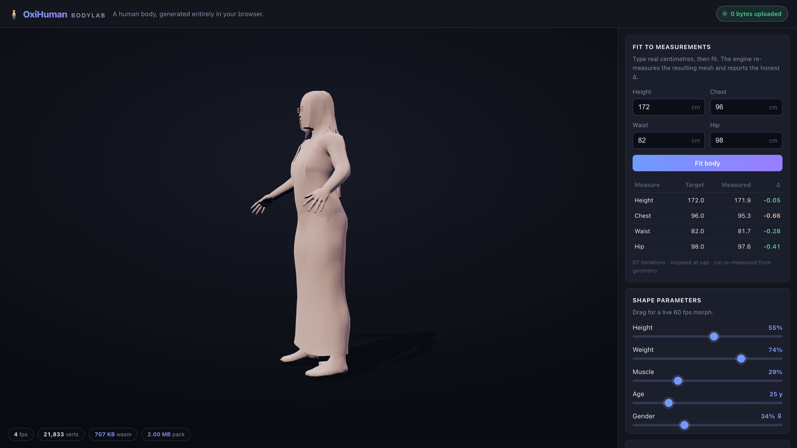

# OxiHuman BodyLab — demo

A single static page that generates a human body **entirely in your browser**.
No server, no upload, no build step at serve time. You load the page, a lit human
stands there breathing, you type measurements or drag sliders, the mesh flows
into shape, and you export GLB / VRM / STL / OBJ files straight from WebAssembly
memory. The privacy pill reads **0 bytes uploaded** — and that claim is computed
at runtime, not asserted.



## What's on the page

* **WebGL2 viewer** (vendored [three.js](vendor/VENDOR.md) r160) — soft studio
  lighting, a matte skin-adjacent material, a shadow-catcher floor, a gentle
  turntable, and a subtle idle-breath animation. The mesh is a `BufferGeometry`
  built **zero-copy** over the engine's WASM memory (positions / normals / uvs /
  indices), re-viewed on generation or buffer change and updated in place.
* **Fit to measurements** — type height / chest / waist / hip in cm, press
  *Fit body*, and read an honest per-measurement `target / measured / Δ` table.
  The Δ is re-measured from the fitted geometry (never echoed); the fit takes
  ~1.3 s, so it runs behind an explicit button + spinner, not per keystroke.
* **Shape sliders** — height / weight / muscle / age / gender, morphing live at
  60 fps (throttled to `requestAnimationFrame`). The age slider's minimum
  respects the pack's declared age floor (`engine.age_floor_years()` = 18 y).
* **Presets** — Average, Athletic, Slender, Heavy, Tall, Reset.
* **Honest badges** — WASM + pack transfer sizes (from
  `performance.getEntriesByType('resource')`), a live rAF FPS meter, the vertex
  count, and the verified "0 bytes uploaded".
* **Offline** — a service worker (`sw.js`) precaches the exact file set, so the
  demo works offline after the first load.

## Run it (no build step at serve time)

```sh
# 1. Build the WASM package + copy the core pack (one time, needs wasm-pack).
scripts/build_demo.sh

# 2. Serve the static directory. Any static server works; no COOP/COEP,
#    no SharedArrayBuffer, no special headers.
cd demo
python3 -m http.server 8000
# open http://localhost:8000
```

If `demo/pkg/` or `demo/pack/` is missing, the page shows a clear error panel
naming the build command instead of failing blankly.

`scripts/demo_serve_check.sh` serves the directory on a free port and asserts
every referenced asset returns HTTP 200 — a stranger / CI can run it to verify
the demo is complete.

## File layout

```
demo/
  index.html            semantic page + import map (maps "three" → vendor/)
  styles.css            studio theme, responsive down to 375 px
  app.js                boot: init WASM → fetch pack → viewer → controls → badges
  src/viewer.js         three.js scene + zero-copy geometry bridge + breath + FPS
  src/controls.js       sliders / presets / measurement fit / exports
  src/badges.js         runtime-read size + FPS + "0 bytes uploaded" badges
  sw.js                 offline precache (list mirrors the real file set)
  vendor/               pinned three.js r160 + OrbitControls + VENDOR.md (sha256)
  pkg/                  wasm-pack --target web output  (built; git-ignored)
  pack/                 oxihuman-core-v1.ohpk          (copied by build_demo.sh)
```

Everything under `pkg/` and `pack/` is a build artefact produced by
`scripts/build_demo.sh`; the committed sources are the HTML/CSS/JS and the
vendored three.js.

## Privacy — why "0 bytes uploaded" is true

The page issues only same-origin **GET** requests (the page, its scripts, the
`.wasm`, and the `.ohpk` pack). There is no upload path: morphing, measuring,
fitting and every exporter run inside the WebAssembly sandbox and files download
via `Blob` URLs. `src/badges.js` verifies this at runtime by summing the bytes of
any cross-origin resource — that sum is `0`, so the badge shows `0 bytes
uploaded`. If anything ever loaded off-origin, the badge would show the real
figure instead.

## Reproducible numbers

The published size / FPS / error numbers each have a one-line reproducer in
[`web/bench/`](../web/bench/README.md).

## Deploying (optional)

The demo is fully static. To host it (e.g. GitHub Pages), run
`scripts/build_demo.sh` and publish the `demo/` directory as-is. It needs no
special server configuration.

## License

Apache-2.0 — Copyright (C) 2026 COOLJAPAN OU (Team KitaSan). Vendored three.js is
MIT (see [`vendor/VENDOR.md`](vendor/VENDOR.md)).
