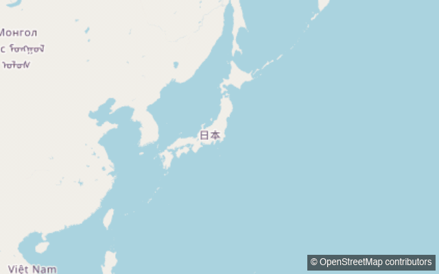
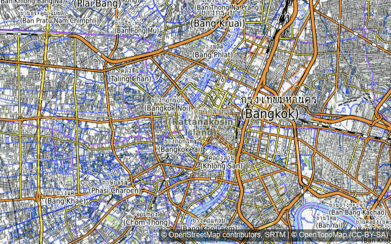

# OxiGIS

**Pure Rust Implementation of Full-Stack GIS Interface** — a QGIS-class
desktop and browser GIS application with zero C/C++/Fortran FFI in its
default features.

**Try it live: [gis.cooljapan.tech](https://gis.cooljapan.tech/)** — the WASM
build running in your browser. Drop a Shapefile, GeoJSON, GeoTIFF, GeoPackage
or PMTiles archive on the map; it is read and rendered in the tab, nothing is
uploaded.



*Basemap © OpenStreetMap contributors*



*City labels in Thai, Bengali, Devanagari, Arabic, Cyrillic and Latin along
Bangkok → Dhaka → Kathmandu → Dubai → Belgrade → Greenwich. Basemap
© OpenStreetMap contributors, SRTM · map style © OpenTopoMap (CC-BY-SA)*

> The sovereignty stack reaches the map.

## What is OxiGIS

OxiGIS is an end-user GIS application built on the COOLJAPAN Pure Rust
ecosystem (OxiGeo for data I/O and CRS, OxiUI for the table model). One
codebase produces two artifacts: a **single native binary** for Linux, macOS
and Windows, and a **single WASM bundle** that runs the same panels, the same
renderer and the same projection math in a browser tab.

The browser build is the point, not a demo trick. Files opened there are read
and rendered locally through WebAssembly — **data never leaves the machine**,
so sensitive layers (cadastral, infrastructure, disaster-response, drone
imagery) can be inspected without an upload step and without installing a
native stack first.

This is a new stack, not a replacement for an old one. GDAL, PROJ and GEOS
remain foundational, and decades of validation are not displaced by an
announcement. What OxiGIS claims is narrower and checkable: a full GIS
interface that builds from source with Cargo alone, runs in the browser, and
is auditable at every layer.

## Features

**Data formats**

- Vector: GeoJSON (dropped, pasted or embedded in a project), ESRI Shapefile,
  OGC GeoPackage (SQLite-backed), GeoParquet (optional `geoparquet` feature)
- Raster and tiles: Cloud-Optimized GeoTIFF over HTTP Range, XYZ tile
  templates (WMTS-REST `{z}/{y}/{x}` endpoints fit the same template),
  Mapbox Vector Tiles (fill / line / circle / symbol)
- Archives: MBTiles and PMTiles, read paged rather than loaded whole

**Coordinate reference systems**

- Built-in EPSG registry: JGD2011 / JGD2000 / Tokyo geographic, all 19
  plane-rectangular zones of each, their UTM zones, plus the common global CRSs
- WKT1 / WKT2 reader, with `TOWGS84[…]` Helmert datum shifts applied rather
  than name-matched away
- A layer in a supported projected CRS is reprojected at ingest, and the layer
  panel names each layer's CRS and warns where a historic datum's shift is only
  meter-accurate

**Rendering**

- Single / Categorized / Graduated renderers, resolved per feature and honored
  identically by the map, the legend, hit-testing and the printed page
- Label engine with a glyph atlas, greedy placement, vertical and bidi-aware
  orientation, and CJK font fallback
- N-layer tile compositing with per-layer opacity in both shells, each layer
  with its own tile cache
- WebGPU in the browser, with automatic WebGL2 fallback

**Editing**

- Sketch, snapping, topology, selection, hit-testing, attribute forms,
  clipboard, and a full undo/redo stack — layer visibility, rename and
  zoom-range changes are undoable project operations too

**Output**

- Print / export to PDF with bidi text shaping and font subsetting, a
  segmented scale bar with its representative fraction, a north arrow, a
  legend, and `/Info` metadata; up to 300 dpi, JPEG- or Flate-encoded
  whichever is smaller
- GeoJSON export of a layer, CSV export of the attribute table

**Application**

- Attribute table, Processing tools that run asynchronously with a progress
  readout and are cancellable, ellipsoidal distance/area measurement,
  on-screen scale bar, go-to-coordinate
- `.oxigis.json` project files (atomic saves), GeoLibre project import
- Browser: `#map=<zoom>/<lat>/<lon>` permalinks and a network activity
  indicator. Desktop: native file dialogs, session persistence, a real command
  line (`--help`, `--version`, `--log-file`, `RUST_LOG`)

## Workspace

| Crate | Role |
|---|---|
| `oxigis-core` | Platform-independent model: layers, styles, renderers, CRS/EPSG registry, project format, Processing registry |
| `oxigis-render` | wgpu tile map renderer — raster (COG/XYZ), vector (MVT), PMTiles, labels |
| `oxigis-ui` | OxiUI (egui) panels: layer tree, style and renderer editors, attribute table, Processing, print |
| `oxigis-web` | WASM shell (wasm-bindgen + WebGPU, `fetch`-backed transports) |
| `oxigis-desktop` | Native shell (winit, Linux/macOS/Windows) — background CJK font discovery for label fallback |

## Status

| Crate | Status | Tests |
|---|---|---|
| `oxigis-core` | Alpha | 224 passing |
| `oxigis-render` | Alpha | 589 passing |
| `oxigis-ui` | Alpha | 1565 passing |
| `oxigis-web` | Alpha | 36 passing (the shell's host-testable halves; the rest is `wasm32`-gated) |
| `oxigis-desktop` | Alpha | 151 passing |

**2565 tests passing, 37 skipped** (workspace-wide, identical in the default
and `--all-features` builds) · zero clippy warnings · zero compiler warnings ·
`#![forbid(unsafe_code)]` in all five crates · Apache-2.0 · Pure Rust, zero
C/C++/Fortran FFI.

## Building

```bash
cargo build --workspace                 # native
cargo build -p oxigis-desktop --release # desktop binary (bin name: oxigis)
wasm-pack build crates/oxigis-web --target web   # browser bundle
```

For a local browser run, `serve.sh` builds the bundle and serves it:

```bash
./crates/oxigis-web/serve.sh        # dev profile, http://localhost:8080
./crates/oxigis-web/serve.sh 9000   # same, on port 9000
./crates/oxigis-web/serve.sh test   # host tests + a wasm32 cargo check
```

Serving on `localhost` is deliberate: WebGPU is only exposed in a secure
context, and a LAN IP over plain HTTP is not one — the app would silently drop
to the WebGL2 fallback.

A hosted build of the same shell (the `wasm-release` profile) is at
[gis.cooljapan.tech](https://gis.cooljapan.tech/), so the browser app can be
tried without building anything.

Pre-commit gate:

```bash
cargo fmt --all && cargo clippy --all-features -- -D warnings \
  && cargo nextest run --all-features && cargo deny check bans
```

## Design principles

- **Memory-safe by construction** — `#![forbid(unsafe_code)]` across all five
  crates, and untrusted inputs bounded by declared geometry rather than
  trusted (COG block sizes, PMTiles directory entries, WKB vertex counts).
- **Auditable supply chain** — `deny.toml` bans the C/C++ crypto and TLS
  stacks outright (`ring`, `aws-lc-*`, `openssl*`, `native-tls`,
  `security-framework-sys`) and the C build toolchains (`cc`, `pkg-config`,
  `cmake`, `bindgen`), admitting `cc`/`pkg-config` only as wrappers of the
  Linux Wayland/X11 windowing glue, which has no pure-Rust equivalent.
  `cargo deny check bans` is part of the release gate.
- **Local-first** — the browser build processes dropped files in the tab. No
  server round-trip, no upload, no account.
- **Correctness is the next frontier.** Memory safety is necessary and not
  sufficient: projection formulas, datum accuracy and format edge cases are
  judged by differential testing against established implementations, public
  conformance suites, fuzzing and real feedback from GIS engineers. That work
  is ongoing, and independent review is welcome.

## Version pins

egui/eframe 0.35.x and wgpu 29.x are held back on purpose: `oxiui-table`
0.2.x requires egui/eframe ^0.35, and egui-wgpu 0.35 — reached through
`eframe`'s `wgpu` feature — tracks wgpu ^29. Bump them only together with an
OxiUI upgrade, and check `cargo tree -d` afterwards (see the note in the root
`Cargo.toml`).

Redistributing the desktop binary or the WASM bundle also means shipping
`NOTICE`: both artifacts compile in five Noto faces under OFL-1.1, plus the
egui/epaint default set (Hack under MIT, Ubuntu-Light under the Ubuntu Font
Licence 1.0, NotoEmoji under OFL-1.1, emoji-icon-font under MIT). Those
notices travel with every copy. `NOTICE` also covers Apache-2.0 §4(d).

## Links

- [`CHANGELOG.md`](CHANGELOG.md) — release notes
- [`TODO.md`](TODO.md) — roadmap
- [COOLJAPAN](https://github.com/cool-japan) — the Pure Rust ecosystem OxiGIS is built on

## License

Apache-2.0 · © 2026 COOLJAPAN OU (Team Kitasan)
